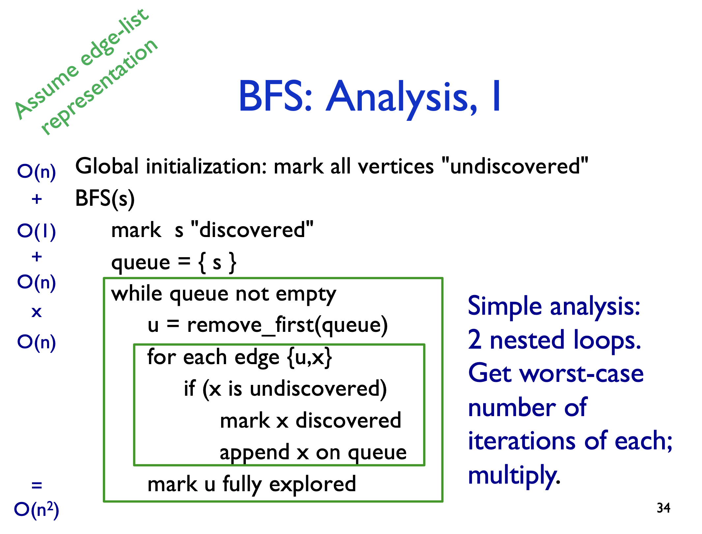
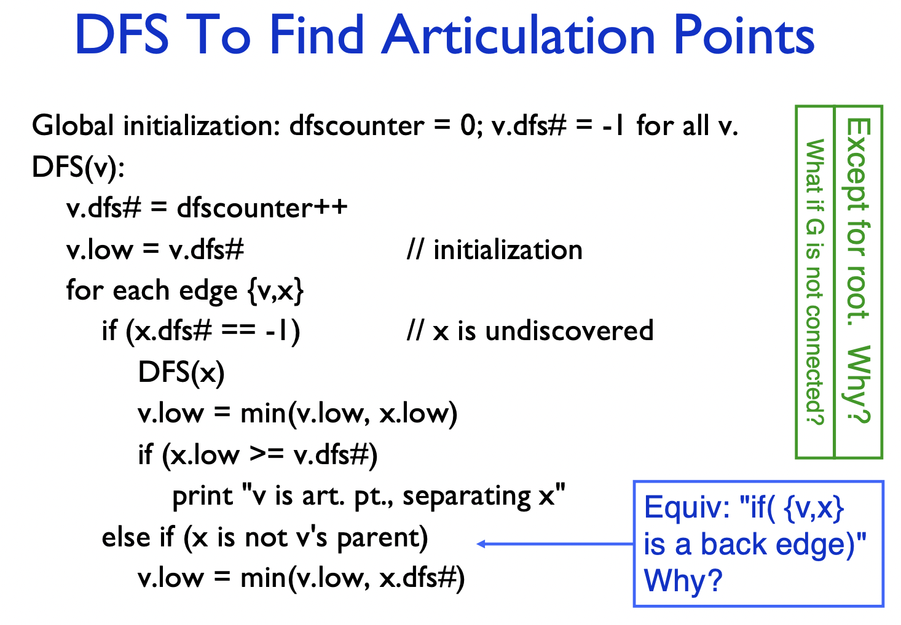
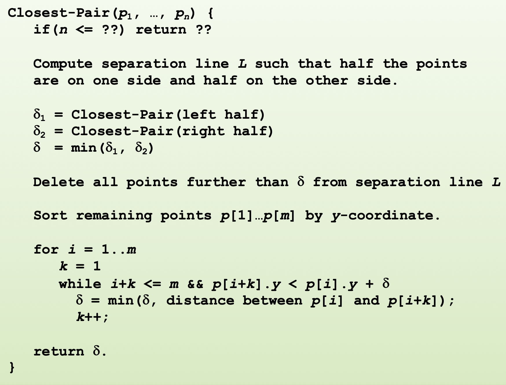
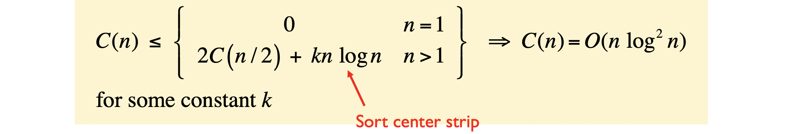
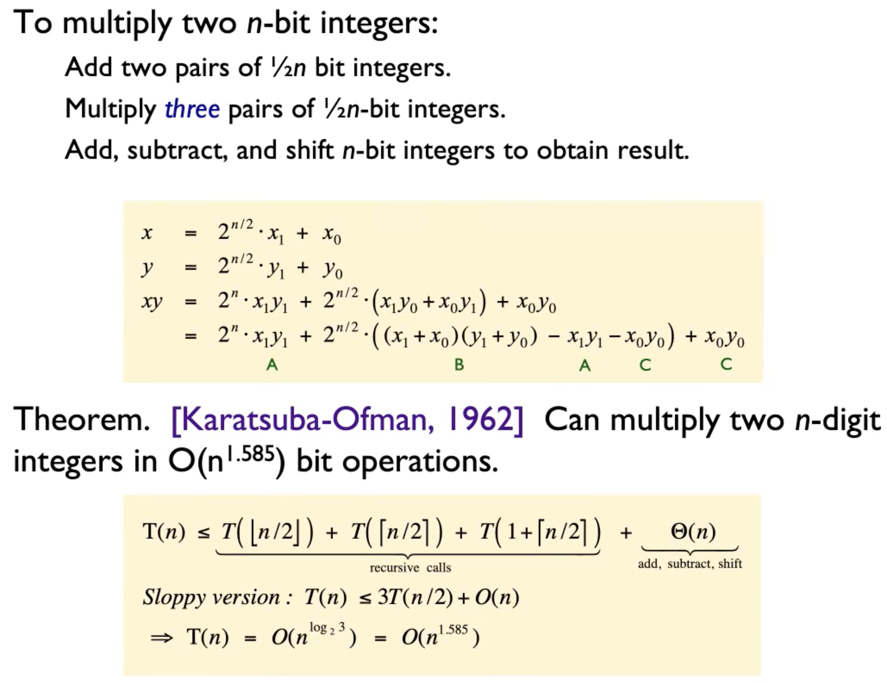

- [Graphs](#graphs)
    - [Breadth-First Search(BFS)](#breadth-first-searchbfs)
      - [Bipartite Graph](#bipartite-graph)
    - [Depth-First Search (DFS)](#depth-first-search-dfs)
      - [Articulation Points](#articulation-points)
  - [Node](#node)
- [Greedy Algorithm](#greedy-algorithm)
  - [Huffman Algorithm](#huffman-algorithm)
- [Divide and conquer](#divide-and-conquer)
  - [Merge sort](#merge-sort)
  - [Closest pair algorithm](#closest-pair-algorithm)
  - [Recurrence](#recurrence)
    - [Karatsuba multiplication](#karatsuba-multiplication)
    - [Master Recurrence](#master-recurrence)
- [Dynamic Programming](#dynamic-programming)

> Week 1 Class 2

## Runtime

**Upper Bounds**:
$f(n)$ is $ O (g(n))$ if there is a constant $c > 0$ so that $f(n)$ is eventually always  $ \le c g(n) $

**Lower Bounds**:
$f(n)$ is $\Omega (g(n))$ if there is a constant $c > 0$ so that $f(n)$ is eventually always  $ \ge c g(n) $

**Both:**
$f(n)$ is $\Theta (g(n))$ if there is are constants $c1, c2 > 0$ so that eventually always $c_1g(n) \le f(n) \le c_2g(n)$

> Week 1 Class 3

**Logarithms**
Change-of=base formula:
$$ log_a(x) = \frac{log_b(x)}{log_b(a)}$$
$$ log_b(a) * log_a(x) = log_b(x)$$

For all $x>0$, *(no mater how small)* $log \ n =O(n^x)$

</br>

```diff
+ Week 2 Class 1
```

# Graphs

Undirected Graph:

Directed Graph:

Sparse graphs: $m ≪ n^2$

</br>

```diff
+ Week 2 Class 2
```

### Breadth-First Search(BFS)

level by level search

runtime:

- $O(n^2)$ in genal. 
- $(n+m) if sparse graphs
Application: Shortest Paths

#### Bipartite Graph

> odd cycle is,

### Depth-First Search (DFS)

go one deep frist and go back

#### Articulation Points



## Node

- Leaf nodes(Leaves): The botten nodes in every way of the tree. Node without children
- Internal nodes: Node have at least one child
- Root: Node without parent

```diff
+ Class 4.1
```

# Greedy Algorithm

```diff
+ Class 4.3
```

## Huffman Algorithm

use the less bits to represent the every elements (the data has probobility)

```diff
+ Class 5.2
```

# Divide and conquer

The basic idea is divide one full size probelem to two half 
## Merge sort

sort the array

## Closest pair algorithm



```diff
+ Class 5.3
```


$C(n)$ is number of comparisons

## Recurrence

Merge sort

```diff
+ Class 6.1 2/7
```

### Karatsuba multiplication



$$\sum ^k_{i=0} x^i = \frac{x^{k+1}-1}{x-1}$$

```diff
+ Class 6.2 2/9
```

### Master Recurrence


```diff 
+ Class 6.3 2/11
```

# Dynamic Programming