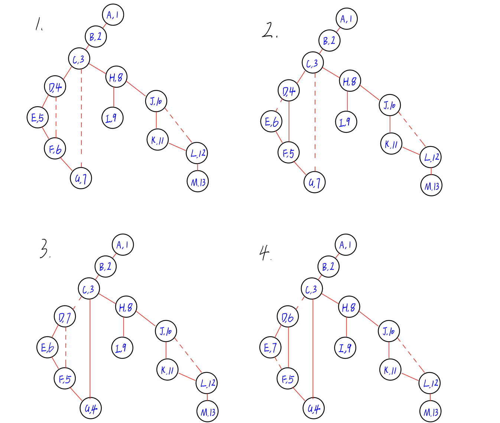

##### CSE 417: Homework 2

##### Name: Qingchuan Hou
##### Student ID: 2127437
##### UWNetID: qhou
 

Problem 3:
There are 8 different spanning trees. It is different because of the different search sequence choice when a node has multiple edges that connect the nodes to the next level.

The search sequence may be different in a DFS spanning tree for example, in the tree 8, the search sequence for node K and M may exchange. 