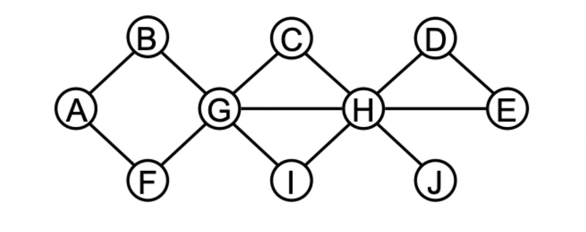

#### CSE 417: Homework 3
##### Name: Qingchuan Hou
##### Student ID: 2127437
##### UWNetID: qhou
 

Problem 2:

Graph:

The biconnected components of the graph:

* Component 1: {{A,B}, {B,G}, {G,F}, {F,A}}
* Component 2: {{C,G}, {G,I}, {I,H}. {H,C}, {G,H}}
* Component 3: {{H,D}, {D,E}, {E,H}}
* Component 4: {{H,J}}