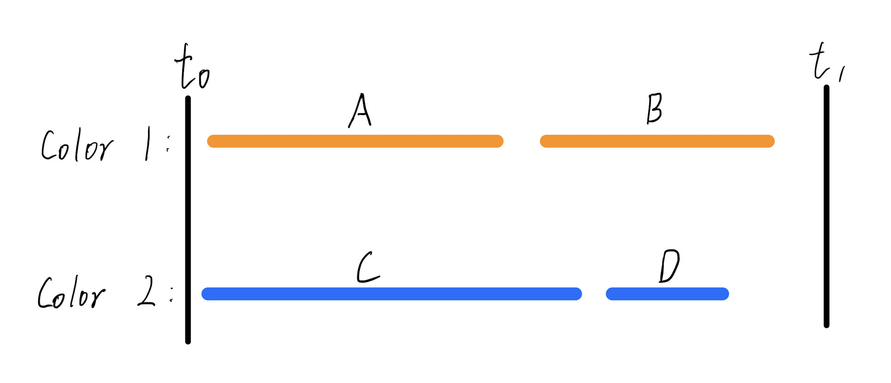

#### CSE 417: Homework 4
##### Name: Qingchuan Hou
##### Student ID: 2127437
##### UWNetID: qhou
 

Problem 1:

Here is a counter example:
If there have four tasks between time $t_0 - t_1$, The four tasks and the optimal solution is shown below:

 
If we use the greedy algorithm for interval by choosing the task which has the smallest finishing time first, then add a new color if there don't have enough time on the existed colors. The solution will be:

This greedy algorithm will choose the smallest finishing time first, so after arranging task A in color 1, it will choose task D instead of task B. Because task D has a smaller finishing time rather than task B. Then every remaining task overlaps the tasks in orange color, then the algorithm will add a new color blue, and assign task C first. But task B overlaps all the tasks in the colors orange and blue. Therefore, the algorithm needs add a new third color to assign task B.
 
The second algorithm has three colors and the first one only has two colors. It is obviously the second greedy algorithm choose the smallest finishiing time first is not the optimal solution in this case.