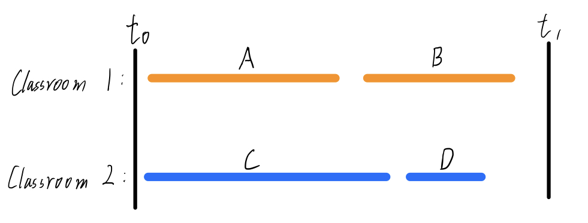
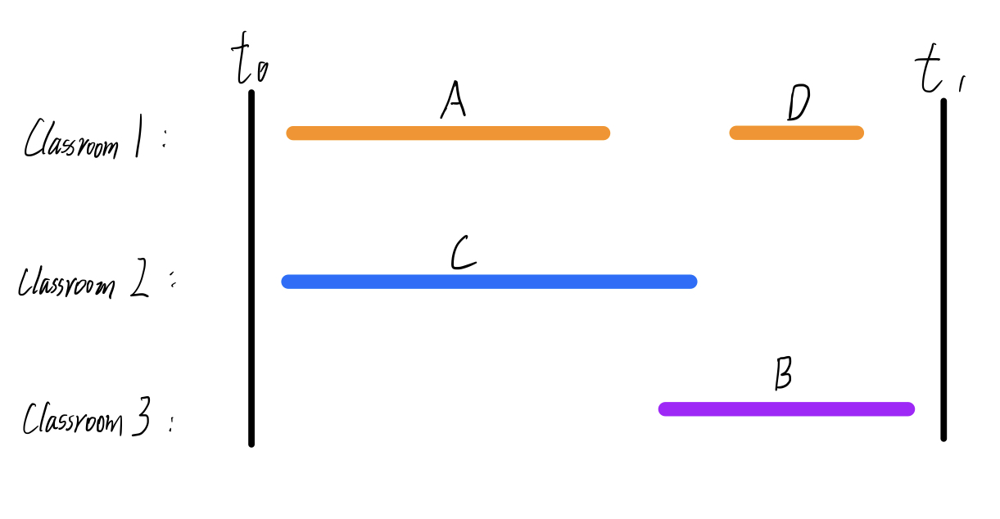

#### CSE 417: Homework 4
##### Name: Qingchuan Hou
##### Student ID: 2127437
##### UWNetID: qhou
 

##### Problem 4:

(a)
Let's use the same example in question 1, it is also a counter example for this question.
Here is the four lectures: A B C D shown below:

If we apply this example to the modeified algorithm. The tasks will sorted by the earliest end time, which is $E_A < E_C < E_D < E_B$

This algorithm will first assign the 1st earlist end tiime lecture A to the classroom 1. Then the algorithm will looking for a room to assign the 2nd earliest end time lecture C. Room 1 doesn't have space for lecture C, so will open a new classroom 2 and schedule lecture C to this room. Then the algorithm will looking for a room to assign the 3rd earliest end time lecture D. Classroom 1 has space, so the lecture D will scheduled in classroom 1. Then the algorithm will looking for a room to assign the last lecture B, because the room 1 and 2 both do not have enough space for lecture B. So the algorithm will open a new classroom 3 to schedule lecture B to rooom 3. Thus, this arrangement opend 3 classrooms to schedule all the lectures.

This modified algorithm has three classrooms to schedule all the lectures and the optimal one only has two classrooms. It is obviously the second arrangement use modified greedy algorithm by choosing the earliest finishiing time first is not the optimal solution in this case.

(b)

After modified it will have a statement that "We sorted by end time, so all incompatibilities are with lecture starting no later than $s_j$." This is not correct. Because we may have some lectures already scheduled which end time is ealier than $i$ and start time is later than $i$. Just like the D compare to B refer the second image.

Also, it will not have d lectures overlap at time $s_j + \epsilon $. Because some lectures arleady scheduled may have a later start time than $j$. For example, there only have 2 lectures overlap in the previous example instead of 3.

The depth of the previous example is 2, but there will have 3 classrooms in this algorithm. The d is not equal to depth. It is not optimal.