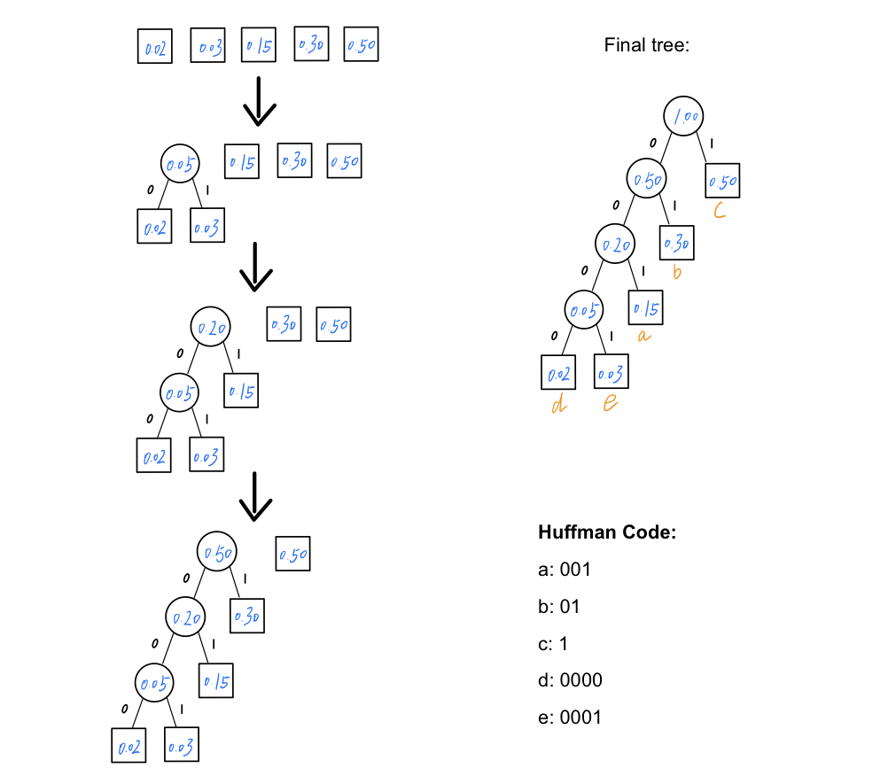

#### CSE 417: Homework 4
##### Name: Qingchuan Hou
##### Student ID: 2127437
##### UWNetID: qhou
 

##### Problem 5:
(a)

(b)
Total leng in bits = $(0.02 \times 4 + 0.03 \times 4 + 0.15 \times 3 + 0.30 \times 2 + 0.50 \times 1) \times 100 $ = $ 175 $

(c)
The length of the Huffman code of a lower frequency element will always be longer or equal to the length of the Huffman code of a higher frequency element. In the Huffman trees, the depth of nodes with lower frequency will always be deeper or equal to the nodes with higher frequency. 

The frequency of $a$ is 0.15, which is lower than the frequency of $b$ 0.30, so in the Hoffman tree, the depth of $a$ should deeper or equal to the depth of $b$. But in the figure, $a$ is in the 2nd level and $b$ is in the 4th level, which a is upper than $b$.