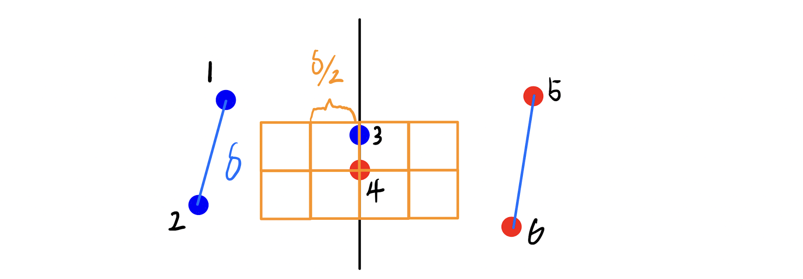

#### CSE 417: Homework 5
##### Name: Qingchuan Hou
##### Student ID: 2127437
##### UWNetID: qhou

 

##### Problem 2:

a) 
When divide n number of full points set in two part, if the point $p_i$ and $p_j$ are the two points in the middle, the $p_i$ will be the last point in the first set and $p_j$ will be the first point in the second set.
If the points have the same x coordinate, we may have $p_i = (x,y)$ and $p_j = (x,y+a)$. Because the $p_i$ and $p_j$ have been divide in different side, the value of $a$ can be any number. It can also less than $\delta /2$. Therefore, the points $p_i$ and $p_j$ may in a edge of same $\delta /2$ by $\delta /2$ square.

For example, if there is a points set has 6 points which is shown in the picture:

In this case, the points 1, 2, 3 are in the left side group, and the points 4, 5, and 6 are in the right side group. The $\delta = min(d_{1,2}, d_{4,5}) = d_{1,2}$, but the distance between 3 and 4 is small than $\delta /2$. Because they have the same x coorniate, they will be in a same $\delta /2$ by $\delta /2$ square.

 

b)
First, we can say that no two points on the same side lie in the same $\delta /2$-by-$\delta /2$ square, because we only consider the points on one side and the closest distance is $\delta$.

Then we can say that there will be $\leq 4$ points in the each side of 2$\delta$-width-strip area within $+\delta$ of y(s_i). Thus, there will be $\leq 8$ points in the of 2$\delta$-width-strip area within $+\delta$ of y(s_i). 
The only condition that will have 8 points in this area is all the 8 points lie in the vertex of $\delta$ by $\delta$ square in each side. Because we sort the points by y coordinate, the distance between the first point on one side and the last point in another side will always be greater than $\delta$. So even when $j-i = 8$, distance between $s_i$ and $s_j$ is $> \delta$ 

Therefore, it has been proved that when $j-i \geq 8$, distance between $s_i$ and $s_j$ is $> \delta$ 