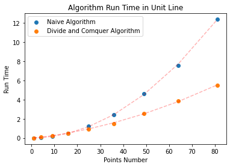
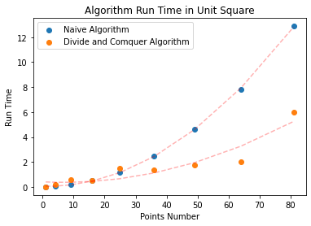
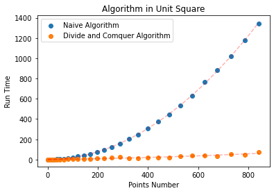
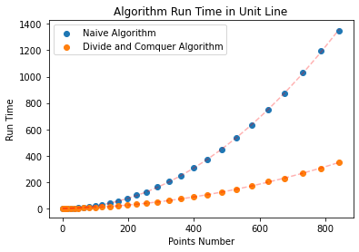

#### CSE 417: Homework 5

##### Name: Qingchuan Hou

##### Student ID: 2127437

##### UWNetID: qhou

 

##### Problem 4:
  
From the plots, we can find that when the number of points n is around 15 should large than before the divide the conquer algorithm is faster than naive method. The reason is because the divide the conquer algorithm needs to compare the data before the points are compared Do some fixed division and merge processing. In the case of fewer points, the time spent in these fixed data processing will make the divide the conquer algorithm more complicated than the naive algorithm.

 
From the plots we can see that in the naive algorithm with a complex of $O(n^2)$, the run time increases exponentially with the increase of the number of points. Compare with naive algorithm, the run time of divide and conquer algorithm with a complexity of $O(nlog^2n)$ grows slowly. Consistent with the big $O()$ theory.

Comparing the two graphs, we find that in the naive algorithmpoint algorithm, the running time of the algorithm is only related to the quantity in the data. However, for the divide and conquer algorithm, when the number of data is the same, the difference in data structure will have a certain impact on the running time of the divide and conquer algorithm. But even in the worst case for the divide and conquer algorithm, such as the one shown on the left, all points are distributed on a vertical line,  the divide and conquer algorithm still has a big advantage over the naive algorithm for larger datasets.