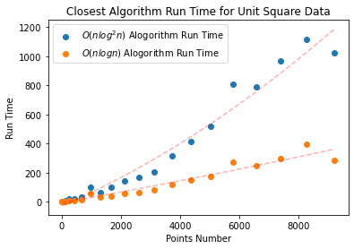
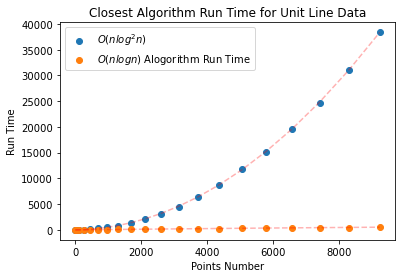

#### CSE 417: Homework 5

##### Name: Qingchuan Hou

##### Student ID: 2127437

##### UWNetID: qhou

 

##### Problem 5:
 
As we can be seen from the plots, the $O(nlogn)$ algorithm requires less run time than the $O(nlog^2n)$ algorithm. Because the $logn$ term in the $O(nlogn)$ algorithm is a first-order term, the growth rate is more stable compared to the $O(nlog^2n)$ algorithm.

The most important thing is that the $O(nlogn)$ algorithm is better at dealing with the more complicated cases for $O(nlog^2n)$. For example, as shown in the second plot, all points are on a line parallel to the y-axis. The run time of the $O(nlogn)$ algorithm is greatly reduced because one sorting of the x-axis is reduced. At this time, the $O(nlog^2n)$ algorithm tends to grow exponentially relative to the $O(nlogn)$ algorithm because $Ologn$ is a square term.

*\* In code, set the 'v3' paremeter in 'main()' to 1 to active the code for $O(nlog^2n)$ algorithm*