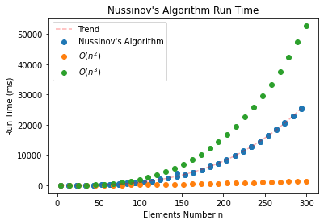

#### CSE 417: Homework 8
##### Name: Qingchuan Hou
##### Student ID: 2127437
##### UWNetID: qhou

 

##### Problem 2:

The graph above shows the number of RNA sequences versus run time. In the timing test, I used the Nussinov's algorithm includes traceback. Because the runtime of Nussinov's algorithm is $O(n^3)$, and the runtime of traceback is $O(n^2)$, the overall time is still $\Theta( n^3)$

I've also drawn lines for runtime $O(n^2)$ and $O(n^4)$ in the plot. It can be seen that the running time of Nussinov's algorithm is consistent with the analysis, and the trend is between the line of $O(n^2)$ and $O(n^4)$.