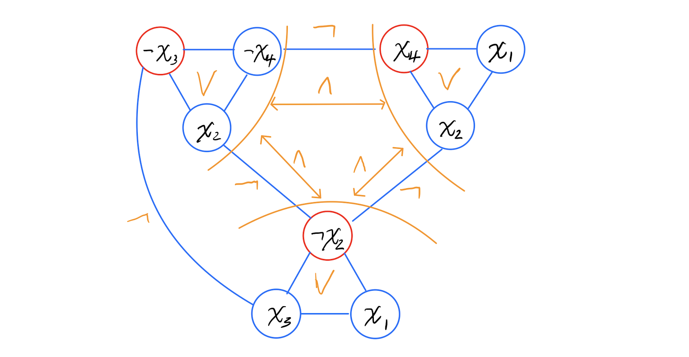

#### CSE 417: Homework 9
##### Name: Qingchuan Hou
##### Student ID: 2127437
##### UWNetID: qhou

 

##### Problem 2:

a)
K = 3

Graph:

The yellow notes represent the Boolean formula

 
 
 
 
 
 
 
 
 

b)
The independent set corresponds to the assignment $x_1 = x_2 = x_3 = False$, $x_4 = True$ is the set in red circle showing on graph.

There are two assignments correspond to that independent set.
1. $x_1 = x_2 = x_3 = False$,
    $x_4 = True$
2. $x_2 = x_3 = False$, 
    $x_1 = x_4 = True$

When $x_2 = x_3 = False$, $\ x_4 = True$, no mater what value $x_1$ is,
$k_1 = x_1 ∨ x_2 ∨ x_4 = True$, because $x_4 = True$
$k_2 = x_1 ∨ ¬x_2 ∨ x_3 = True$, because $¬x_2 = True$
$k_3 = x_2 ∨ ¬x_3 ∨ ¬x_4 = True$, because $¬x_3 = True$

Therefore,
$$ k_1 ∧ k_2 ∧ k_3 = True$$

These two assignments are both satisfy the Boolean formula.