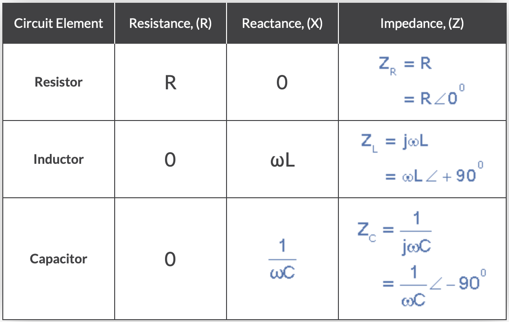
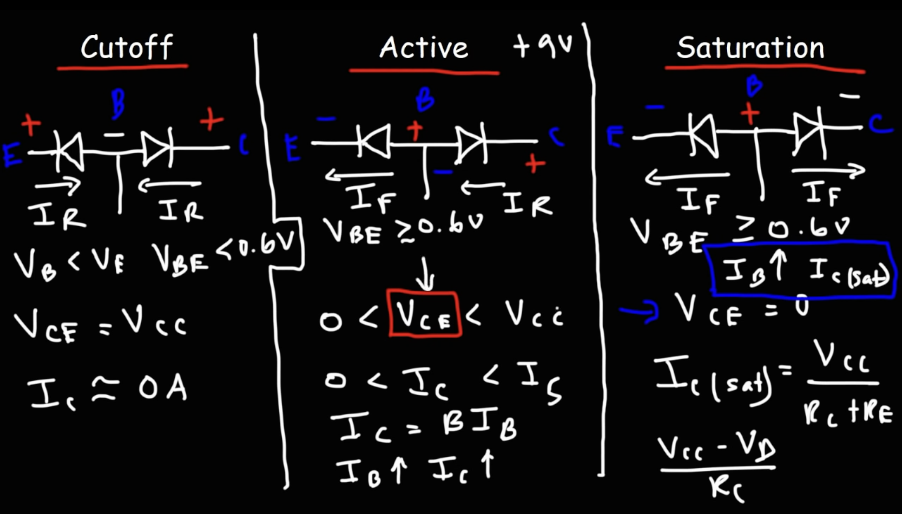

- [RLC Circuit](#rlc-circuit)
  - [Basic RLC](#basic-rlc)
    - [Resonate](#resonate)
  - [Frequency Filter](#frequency-filter)
    - [Low-Pass and High-Pass Filter](#low-pass-and-high-pass-filter)
    - [Band Pass and Band Stop Filter](#band-pass-and-band-stop-filter)
- [Bipolar Junction Transistors (BJT)](#bipolar-junction-transistors-bjt)
  - [Amplifier](#amplifier)
- [MOS](#mos)

**Analog Circuit**

## RLC Circuit

### Basic RLC
[Series RLC](https://www.electronics-tutorials.ws/accircuits/series-circuit.html)

#### Resonate
The resonate frequency of CL circuit is:
$$f_0 = \frac{1}{2\pi \sqrt{L C}}$$

When resonate:
1. the series LC circuit will have infinity impedance,consider as **open circuit** (the current in LC loop is back-forth)
2. the parallel LC circuit will have 0 impedance, consider as **short circuit**
### Frequency Filter

#### Low-Pass and High-Pass Filter
Reluctance Frequency: $f_r = \frac{1}{2\pi \sqrt{RC}} = \sqrt{f_Hf_L}$

Inductor(L): Pass Low level frequency
Conductor(C): Pass High level frequency

#### Band Pass and Band Stop Filter

## Bipolar Junction Transistors (BJT)

base, collector, emitter

The arrow is current direction for emitter

Cutoff: $V_{BE} < 0.6, \ V_{CE} = V_{CC}, \ I_C = 0 $
Active: $V_{BE} \ge 0.6, \ 0 < V_{CE} < V_{CC}, \ I_C > 0 $
Saturation: $V_{BE} \> 0.6, \ V_{CE} = 0 $

### Amplifier

## MOS

current mirror

amplifying transconductance

