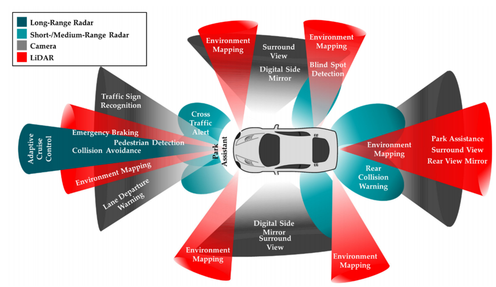

# Sensor

- [Sensor](#sensor)
  - 
  - [LiDAR and Radar](#lidar-and-radar)
    - [LiDAR (Light Detection and Ranging)](#lidar-light-detection-and-ranging)

##

## LiDAR and Radar

LiDAR（激光雷达）、Radar（毫米波雷达）、ultrasonic sensor（超声波雷达）、Synthetic Aperture Radar（合成孔径雷达）

### LiDAR (Light Detection and Ranging)

| 参数             | Radar                                  | LiDAR                                    |
| ---------------- | -------------------------------------- | ---------------------------------------- |
| 最大感知范围(m)  | 1000                                   | 200                                      |
| 速度范围（km/h） | > 1000                                 | >200                                     |
| 径向运动分辨率   | 好                                     | 好                                       |
| 切向运动分辨率   | 差                                     | 差                                       |
| 静止测距         | 复杂                                   | 简单                                     |
| 角度测量能力     | 较好                                   | 好                                       |
| 环境适应         | 强                                     | 弱                                       |
| 成本             | 较低                                   | 高                                       |
| 穿透性           | 强                                     | 弱                                       |
| 优点             | 不受天气、昼夜光线的影响，探测距离远   | 测距精度高，方向性强，不易受地面杂波干扰 |
| 缺点             | 目标识别难度稍大，精度稍低，有杂波干扰 | 成本高，探测范围小，遇到恶劣天气无法工作 |
