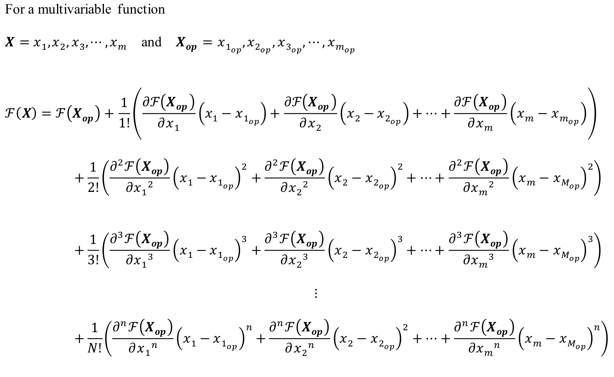
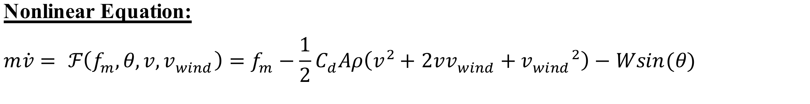
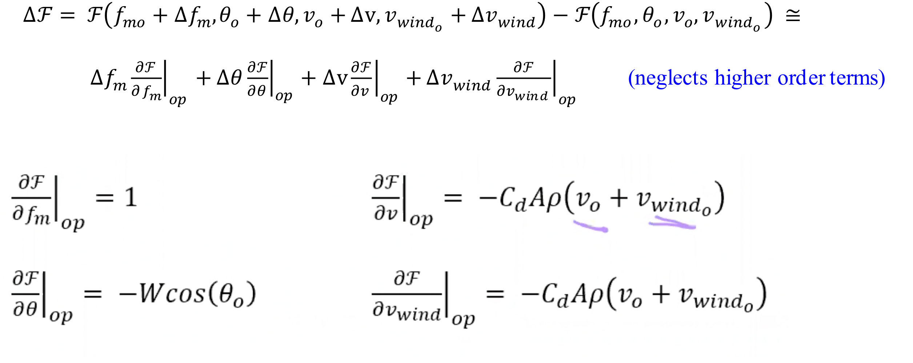
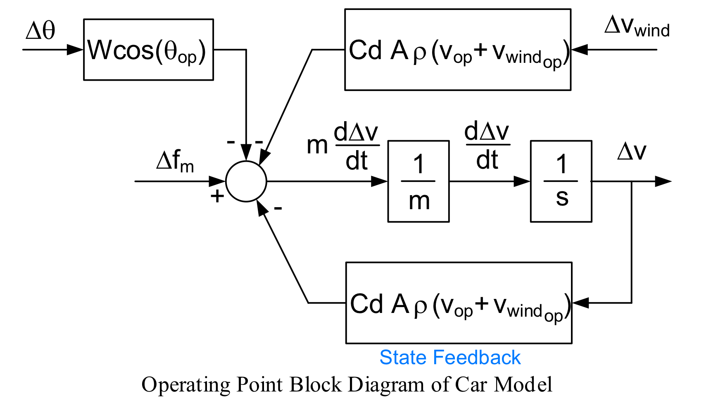
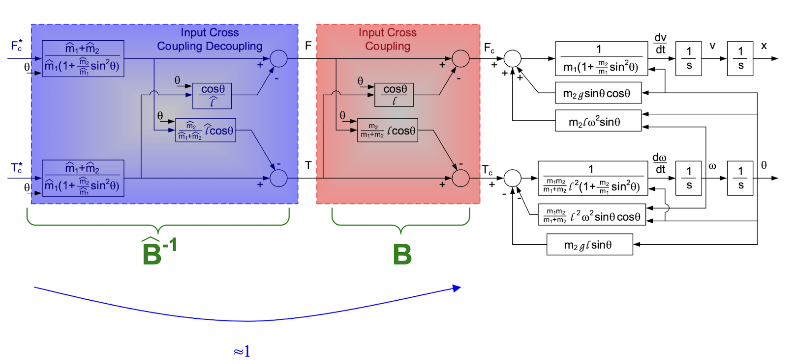

# Dynamics Of Controlled Systems

```diff
+ Class 1, Wed, Oct/3/2022
```
 

 

Mason's method?

HW: Simulink symbolic


```diff
+ Class 2, Mon, Oct/10/2022,
```

### Operating Point Analysis

#### Taylor Series Approximation


$$\Delta \mathcal{F}(x) = \mathcal{F}(x) - \mathcal{F}(x_{op}) \cong \Delta x \cdot\mathcal{F'}(x_{op}) \qquad x = x_{op}+\Delta x$$

Neglects higher order terms, because the 1st derivative term can give a good proximation on $\Delta \mathcal{F}$

Example: Cos(x)


Multi-variable Operating System:


#### Car Model:

 \
 

Operating:



 \
 \


-3db

$x(t) = sin(2 \pi f_0 t) --> y(t) = 0.707sin(2 \pi f_0 t)$

-3db $\approx$ 0.5  &emsp; 0.707 $\approx$ 1/ $\sqrt{2}$


```diff
+ Class 3, Mon, Oct/17/2022,
```

Virtue zero reference give the Steady State error to be zero

```diff
+ Class 4, Mon, Oct/24/2022,
```
Steady State: The state when time go to infinity

Steady State error: $e_{ss} = \lim_{t \to \infty}e(t) = \lim_{s\to 0} sE(s)$ &emsp; (s = 0 in transfer function)

Manipulated Input Coupling System 

Lagrangian Solution:
L = T - V
T: Kinetic Energy （$T_e = \frac{1}{2}mv^2$) 动能
V: Potential Energy ($V_e = F*s$) 势能

### Decoupling
Decoupling:
让相互影响的输入项变成独立的


The $F_c$ and $T_c$ is what we want control, but it is not the real state in the real system. F and T are cross-coupled.




By decoupling $F_c^*$ is approximate to $F_c$ and not infused by another input $T_c$

