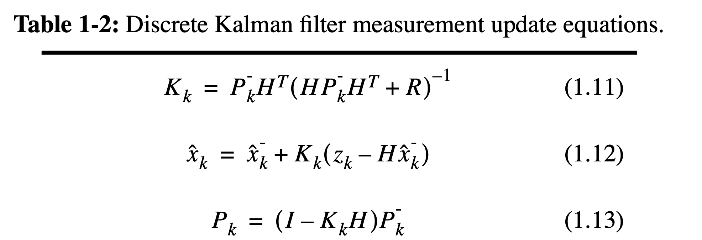

# Kalman Filtering

- [Kalman Filtering](#kalman-filtering)
  - 
    - [State Space Equation](#state-space-equation)
  - [Kalman Equation](#kalman-equation)
  - [Study method (ChatGPT)](#study-method-chatgpt)

##
卡尔曼滤波中 预测值是估计值和测量值的和（不同系数）
估计值是拿上一位置经过估计系数估计出来的值
测量值是测量仪测出的值（测量值一定存在一定误差）
通过调整预测值和估计值的比例和，从而酸楚比较准确的状态估计值

### State Space Equation

State Equation: $x_k = A x_{k-1} + B u_k + w_k$
Output Equation: $y_k = C x_k +v_k$

## Kalman Equation
[卡尔曼滤波（Kalman Filter）原理与公式推导 - 知乎](https://zhuanlan.zhihu.com/p/48876718)
[An Introduction to the Kalman Filter (PDF)](src/ref/kalman_intro.pdf)

$x_k$ : 状态的真实值；

$\hat{x}_{k}^{-}$ : 状态的预测值，也称先验状态估计值（a prior state estimate）；

$\hat{x}_{k}$ : 状态的最优估计值，也称后验状态估计值（a posterior state estimate）；

状态预测方程： $\hat{x}_{k}^{-} = A*\tilde{x}_{k-1} + B*u_{k}$

状态测量方程： $\hat{x}_{k}=\tilde{x}_{k}^{-}+K(z_{k}-H*\tilde{x}_{k}^{-})$

卡尔曼增益矩阵: $K$
$$K=P_{k}^{-}H^{T}(HP_{k}^{-}H^{T}+R)^{-1}$$
卡尔曼增益  实际上表征了状态最优估计过程中模型预测误差（Predicted error）与量测误差（Measurement error）的比重（如下所示），即$K \in[0,1]$。当$K=0$时，即预测误差为0，系统的状态值完全取决与预测值（$\hat{x}_{k} = \hat{x}_{k}^{-}$ ）；而当$K=1$时，即量测误差为0，系统的状态值完全取决于量侧值。

## Study method (ChatGPT)

学习卡尔曼滤波可以按照以下步骤进行：

1. 理解线性代数和概率统计：卡尔曼滤波器的理论基础涉及线性代数和概率统计的概念。确保你对向量、矩阵操作、线性方程组、协方差矩阵等基本概念有一定的了解。

2. 学习系统动力学模型和测量模型：了解卡尔曼滤波器中使用的系统动力学模型和测量模型。系统动力学模型描述系统状态如何演化，测量模型描述如何从系统中获取观测数据。对于线性卡尔曼滤波器，系统动力学模型和测量模型都是线性的，而非线性卡尔曼滤波器需要使用扩展卡尔曼滤波或其他非线性滤波方法。

3. 学习卡尔曼滤波的基本算法：了解卡尔曼滤波的基本算法，包括预测步骤和校正步骤。掌握如何使用系统动力学模型进行状态预测，如何使用测量模型进行状态校正，以及如何计算状态估计和协方差矩阵。

4. 使用数学工具进行实践：使用数学工具（如 MATLAB、Python 等）实现卡尔曼滤波算法并进行实践。可以使用已有的卡尔曼滤波库或从头开始编写代码实现。通过编写代码并应用于实际问题，加深对卡尔曼滤波的理解。

5. 阅读相关文献和教程：阅读相关的学术论文、教科书或在线教程，深入了解卡尔曼滤波的理论和应用。了解不同领域中使用卡尔曼滤波的案例和实际应用。

6. 实践项目：尝试在实际项目中应用卡尔曼滤波。选择一个合适的问题领域（如机器人导航、无人机控制等），并尝试使用卡尔曼滤波进行状态估计或轨迹跟踪。

7. 深入研究扩展卡尔曼滤波和其他变种：了解扩展卡尔曼滤波（EKF）和其他变种，这些方法用于处理非线性系统动力学模型和非高斯观测数据。深入研究这些方法可以进一步扩展你的滤波器设计能力。

8. 参与相关课程或培训：如果你需要更系统和深入的学习，考虑参加相关的课程、培训或研讨会。这样可以获得更结构化和指导性的学习体验，并与其他学习者交流和分享经验。

记住，卡尔曼滤波是一个复杂的主题，需要一定的时间和实践才能熟练掌握。通过不断的学习和实践，逐步提升对卡尔曼滤波的理解和应用能力。