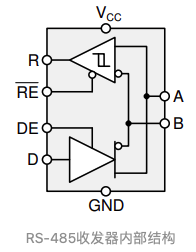

- [同步通讯与异步通讯](#同步通讯与异步通讯)
- [全双工 与 半双工](#全双工-与-半双工)
- [通讯协议](#通讯协议)
  - [I2C (Inter－Integrated Circuit)](#i2c-interintegrated-circuit)
    - [I2C时序](#i2c时序)
  - [SPI 协议](#spi-协议)
    - [时钟极性](#时钟极性)
    - [时钟相位](#时钟相位)
    - [四种数据传输模式](#四种数据传输模式)
  - [UART](#uart)
    - [UART 时序](#uart-时序)
    - [USART](#usart)
  - [USB (Universal Serial Bus)](#usb-universal-serial-bus)
    - [USB 编码 （NRZI 编码（Non-Return-to-Zero Inverted Code）](#usb-编码-nrzi-编码non-return-to-zero-inverted-code)
    - [SWD](#swd)
  - [CAN (Controller Area Network)](#can-controller-area-network)
- [电平标准](#电平标准)
  - [TTL (Transistor Transistor Logic)](#ttl-transistor-transistor-logic)
  - [RS-232](#rs-232)
  - [RS-485](#rs-485)
  - [CMOS](#cmos)
  - [MODEM](#modem)
    - [DCD、DTR、DSR、RTS 及 CTS 等五个状态指示](#dcddtrdsrrts-及-cts-等五个状态指示)
  - [TCP/IP](#tcpip)
- [数据模式](#数据模式)
- [ARM 总线](#arm-总线)
  - [AHB APB](#ahb-apb)

## 同步通讯与异步通讯

**同步通讯**：
同步通讯是一种连续串行传送数据的通信方式，一次通信只传送一帧信息。这里的信息帧与异步通信中的字符帧不同，通常含有若干个数据字符。
采用同步通信时，将许多字符组成一个信息组，这样，字符可以一个接一个地传输，但是，在每组信息（通常称为帧）的开始要加上同步字符，在没有信息要传输时，要填上空字符，因为同步传输不允许有间隙。在同步传输过程中，一个字符可以对应 5 ～ 8 位。

**异步通讯**：
异步通信是一种很常用的通信方式。异步通信在发送字符时，所发送的字符之间的时间间隔可以是任意的。当然，接收端必须时刻做好接收的准备。发送端可以在任意时刻开始发送字符，因此必须在每一个字符的开始和结束的地方加上标志，即加上开始位和停止位，以便使接收端能够正确地将每一个字符接收下来。异步通信的好处是通信设备简单、便宜，但传输效率较低（因为开始位和停止位的开销所占比例较大）。

异步串行通信的数据每个字符（每帧信息）由 4 个部分组成：

（1）1 位起始位，规定为低电 0；

（2）5 ～ 8 位数据位，即要传送的有效信息；

（3）1 位奇偶校验位；

（4）1 ～ 2 位停止位，规定为高电平 1。

同步通信与异步通信区别：

1. 同步通信要求接收端时钟频率和发送端时钟频率一致，发送端发送连续的比特流；异步通信时不要求接收端时钟和发送端时钟同步，发送端发送完一个字节后，可经过任意长的时间间隔再发送下一个字节。
2. 同步通信效率高；异步通信效率较低。
3. 同步通信较复杂，双方时钟的允许误差较小；异步通信简单，双方时钟可允许一定误差。
4. 同步通信可用于点对多点；异步通信只适用于点对点。

## 全双工 与 半双工

**全双工**：两条线同时传输

**半双工**：
 

**半工（单工）**：

> 全双工：打电话；半双工：对讲机；单工：广播

## 通讯协议

首先，串口、UART 口、COM 口、USB 口是指的物理接口形式(硬件)。而 TTL、RS-232、RS-485 是指的电平标准(电信号)。

串口：串口是一个泛称，UART，TTL，RS232，RS485 都遵循类似的通信时序协议，因此都被通称为串口。

UART 接口：通用异步收发器（Universal Asynchronous Receiver/Transmitter)，UART 是串口收发的逻辑电路，这部分可以独立成芯片，也可以作为模块嵌入到其他芯片里，单片机、SOC、PC 里都会有 UART 模块。

COM 口：特指台式计算机或一些电子设备上的 D-SUB 外形(一种连接器结构，VGA 接口的连接器也是 D-SUB)的串行通信口，应用了串口通信时序和 RS232 的逻辑电平。

USB 口：通用串行总线，和串口完全是两个概念。虽然也是串行方式通信，但由于 USB 的通信时序和信号电平都和串口完全不同，因此和串口没有任何关系。USB 是高速的通信接口，用于 PC 连接各种外设，U 盘、键鼠、移动硬盘、当然也包括“USB 转串口”的模块。（USB 转串口模块，就是 USB 接口的 UART 模块）

TTL，RS232，RS485 都是一种逻辑电平的表示方式

| 名称  |         引脚         | 双工   | 时钟 | 电平 | 设备   |
| :---: | :------------------: | ------ | ---- | ---- | ------ |
| USART |        TX, RX        | 全双工 | 同步/异步 | 单端 | 点对点 |
|  I2C  |       SCL, SDA       | 半双工 | 同步 | 单端 | 多设备 |
|  SPI  | SCLK, MOSI, MISO, CS | 全双工 | 同步 | 单端 | 多设备 |
|  CAN  |     CAN_H. CAN_L     | 半双工 | 异步 | 差分 | 多设备 |
|  USB  |        DP. DM        | 半双工 | 异步 | 差分 | 点对点 |

### I2C (Inter－Integrated Circuit)

> [I2C 通信协议介绍(知乎)](https://zhuanlan.zhihu.com/p/137568249)

同步通讯，半双工

·它是一个支持设备的总线。“总线”指多个设备共用的信号线。在一个 I2C 通讯总线中，可连接多个 I2C 通讯设备，支持多个通讯主机及多个通讯从机。

·一个 I2C 总线只使用两条总线线路，一条双向串行数据线(SDA)，一条串行时钟线(SCL)。数据线即用来表示数据，时钟线用于数据收发同步。

·每个连接到总线的设备都有一个独立的地址，主机可以利用这个地址进行不同设备之间的访问。

·总线通过上拉电阻接到电源。当 I2C 设备空闲时，会输出高阻态，而当所有设备都空闲，都输出高阻态时，由上拉电阻把总线拉成高电平。

·多个主机同时使用总线时，为了防止数据冲突，会利用仲裁方式决定由哪个设备占用总线。

·具有三种传输模式：标准模式传输速率为 100kbit/s，快速模式为 400kbit/s，高速模下可达 3.4Mbit/s，但目前大多 I2C 设备尚不支持高速模式。

I2C 开始通讯时，主机通过 SDA 线寻址查找 slave

#### I2C时序

高位先行

- 起始条件：SCL高电平期间，SDA从高电平切换到低电平
- 终止条件：SCL高电平期间，SDA从低电平切换到高电平

地址读取：地址为7位 (通常为0x68)，读写选择为是第8位
在通讯开始时有两种方法：
1. 写入地址 (0x68) 并左移一位，然后写入0或1读写位
2. 直接写入已经加入读写位的8位地址（0xD0）或者（0xD1）

[I2C 电路设计](../CircuitDesign.md#i2c)

### SPI 协议

同步通讯, 全双工

单主机多从机

SCK/SCLK：主要的作用是 Master(主)设备往 Slave(从)设备传输时钟信号, 控制数据交换的时机以及速率；
SS/CS：用于 Master(主)设备片选 Slave (从)设备，使被选中的 Slave(从)设备能够被 Master(主)设备所访问；
SDO/MOSI：(Master out Slave in)在 Master(主)上面也被称为 Tx-Channel，作为数据的出口，主要用于 SPI 设备发送数据；
SDI/MISO：在 Master(主)上面也被称为 Rx-Channel，作为数据的入口，主要用于 SPI 设备接收数据；

#### 时钟极性

数据传输时的电平模式

CKP = 0：时钟空闲 IDLE 为低电平 0.
CKP = 1：时钟空闲 IDLE 为高电平 1。

#### 时钟相位

数据收发在时钟的上升沿或者下降沿

CKE = 0：在时钟信号 SCK 的第一个跳变沿采样；
CKE = 1：在时钟信号 SCK 的第二个跳变沿采样。

#### 四种数据传输模式

### UART

[URAT 知乎](https://zhuanlan.zhihu.com/p/182321407)

Universal Asynchronous Receiver/Transmitter，意为通用异步收发传输器。全双工通讯

<i>URAT帧模式(Frame Format)</i>

TX（Transfer Exchange）：发送引脚
RX（Receive Exchange）：接收引脚

#### UART 时序

起始位：发送 1 位逻辑 0（低电平），开始传输数据。
数据位：可以是 5~8 位的数据，先发低位，再发高位，一般常见的就是 8 位（1 个字节），其他的如 7 位的 ASCII 码。
校验位：奇偶校验，将数据位加上校验位，1 的位数为偶数（偶校验），1 的位数 4 为奇数（奇校验）。
停止位：停止位是数据传输结束的标志，可以是 1/1.5/2 位的逻辑 1（高电平）。
空闲位：空闲时数据线为高电平状态，代表无数据传输。

低位先行

**UART 传输速率的概念——波特率**
波特率的单位是 bps，全称是 bit per second，意为每秒钟传输的 bit 数量。

为了确保数据传输的正确性，减少误差，一般 UART1 和 UART2 之间的波特率差别小于 10%，一次最多只能传输 1 个字节（8bit），也有效减小了累计误差。

#### USART

Universal Synchronous Asynchronous Receiver and Transmitter 通用同步/异步收/发器
USART 在 UART 基础上增加了同步功能，（增加了时钟信号），即 USART 是 UART 的增强型，通常情况下不使用同步功能。

[USART_MCU](../../../EmbeddedSystem/MCU/MCU_Note.md#usart)

### USB (Universal Serial Bus)

[USB 协议详解（CSDN 专栏）](http://t.csdn.cn/fqRia)
[USB 协议（知乎）](https://zhuanlan.zhihu.com/p/558672045)

USB 协议采用的是差分传输模式

**USB 的电气特性**

主机端的 D-和 D+数据线各自被串联 15KR 电阻下拉到地，当没有 USB 设备插入的时候，这两条数据线就一直呈现低电平状态。

USB 是一种主从工作模式，大多数时候主机被叫“Host”，从机被叫“Device”

设备端的 D-或者 D+数据线，串联一个 1.5KR 的电阻上拉到 3.3V，一旦设备插入主机，那么当主机捕捉到自身的 D-或者 D+被拉到高电平时，就知道有 USB 设备连接进来了，这样就检测到有外来 USB 设备接入了。

对于从机设备中到底是 D-还是 D+串联 1.5KR 电阻，这个就要有传输协议的模式来决定了，当配置成全速或高速时，就由 D+串联电阻；当配置成低速时，就是 D-串联电阻了。

简单来说就是快的就连 D+，慢的就连 D-。

**USB 总线状态**

#### USB 编码 （NRZI 编码（Non-Return-to-Zero Inverted Code）

[USB 编码方式（NRZI）及时钟同步方式（CSDN）](https://blog.csdn.net/weiaipan1314/article/details/111877381)
**USB 自同步传输**
USB 没有时钟信号

**RZ 编码（Return-to-zero Code）**：在 RZ 编码中，正电平代表逻辑 1，负电平代表逻辑 0，并且，每传输完一位数据，信号返回到零电平，也就是说，信号线上会出现 3 种电平：正电平、负电平、零电平

因为每位传输之后都要归零，所以接受者只要在信号归零后采样即可，这样就不在需要单独的时钟信号。实际上， RZ 编码就是相当于把时钟信号用归零编码在了数据之内。这样的信号也叫做自同步（self-clocking）信号。

因为 RZ 编码每次信号传输都要归零，浪费带宽，所以使用 NRZI

NRZI 都没有自同步特性，但是可以用一些特殊的技巧解决。

比如，先发送一个同步头，内容是 0101010 的方波，让接受者通过这个同步头计算出发送者的频率，然后再用这个频率来采样之后的数据信号，就可以了。

**NRZI**
NRZI 用信号的翻转代表一个逻辑，信号保持不变代表另外一个逻辑。

USB 传输的编码就是 NRZI 格式，在 USB 中，电平翻转代表逻辑 0，电平不变代表逻辑 1

这样的通讯方法仍然存在一个问题，假如数据信号是 1000 个逻辑 1，经过 USB 的 NRZI 编码之后，就是很长一段没有变化的电平，在这种情况下，即使接受者的频率和发送者相差千分之一，就会造成把数据采样成 1001 个或者 999 个 1 了。

USB 对这个问题的解决办法，就是强制插 0，也就是传说中的 bit-stuffing，如果要传输的数据中有 6 个连续的 1，发送前就会在第 6 个 1 后面强制插入一个 0，让发送的信号强制出现翻转，从而强制接受者进行频率调整。这样还是会有一个问题，就是虽然接受者可以主动和发送者的频率匹配，但是两者之间总会有误差。

#### SWD

SWD 串行调试接口

SWDIO: 串行数据线，用于数据的读出和写入
SWDCLK: 串行时钟线，提供所需要的时钟信号

### CAN (Controller Area Network)

## 电平标准

### TTL (Transistor Transistor Logic)

即晶体管-晶体管逻辑电平。

TTL 电平信号规定，**+5V 等价于逻辑“1”，0 V 等价于逻辑“0”** (采用二进制来表示数据时)。

这样的数据通信及电平规定方式，被称做 TTL（晶体管-晶体管逻辑电平）信号系统，这是计算机处理器控制的设备内部各部分之间通信的标准技术。一般的电子设备用的多是 TTL 电平，但是它的驱动能力和抗干扰能力很差，不适合作为外部的通信标准，一些通信方式如 RS232、RS485、USB 等在传输线上使用的不是 TTL 电平，因此这些通信线上的信号在电子设备端要进行电平转换，才能够正常通信。

### RS-232

**RS-232 电平：全双工 (逻辑 1：-15V--5V 逻辑 0：+3V--+15V)**

rs232 的逻辑电平和 TTL 不一样但是协议一样。

### RS-485

[RS-485 知乎](https://zhuanlan.zhihu.com/p/341845459)

标准名称是 TIA485/EIA-485-A

使用差分传输，共模抑制。使用一对双绞线，其中一根线定义为 A，另一个定义为 B.
RS-485 不需要使用特定的总线电压，只看最小差分电压，在较长的电缆长度上，接收器接收到的电压可能会降低到+/- 200 mV，这对于 RS-485 仍然是完全可以接受的，这也是 RS-485 的优点之一。

半双工模式

**RS-485：半双工、差分信号（逻辑 1：+2V--+6V（压差） 逻辑 0： -6V---2V）**

- A 和 B 为总线；
- R 为接收器输入；
- RE 为接收器使能信号；
- DE 为发送器使能信号；
- D 为发送器输出

**发送器：**
当驱动器使能引脚 DE 为逻辑高时，差分输出 A 和 B 遵循数据输入 D 处的逻辑状态。D 处的逻辑高导致 A 转为高，B 转为低。在这种情况下，定义为 VOD=VA-VB 的差分输出电压为正。当 D 为低时，输出状态反转，B 变高，A 变低，VOD 为负。

**接收器：**
当接收器使能引脚 RE 逻辑低时，接收器被激活。当定义为 VID=VA–VB 的差分输入电压为正且高于正输入阈值 VIT+时，接收机输出 R 变高。当 VID 为负且低于负输入阈值 VIT-，接收机输出 R 变低。如果 VID 在 VIT+和 VIT-之间，则输出不确定。

有一些电路中会在 A 上加上拉，B 上加下拉电阻，主要原因是：RS-485 总线在 idle 状态，电平是不固定的，即电平在-200mV~+200mV 之间，收发器可能输出高也可能输出低，UART 在空闲时需要保持高电平的，如果此时收发器输出一个低电平，对 UART 来说是一个 start bit，会导致通信异常

### CMOS

输出 L：<0.1*Vcc；H:>0.9*Vcc。

输入 L：<0.3*Vcc；H:>0.7*Vcc。

### MODEM

#### DCD、DTR、DSR、RTS 及 CTS 等五个状态指示

[CSDN Reference](https://blog.csdn.net/xqhrs232/article/details/8544054)

DCD （ Data Carrier Detect 数据载波检测）

DTR（Data Terminal Ready，数据终端准备好）

DSR（Data Set Ready 数据准备好）

RTS（ Request To Send 请求发送）

CTS（Clear To Send 清除发送）

### TCP/IP

TCP/IP (Transmission Control Protocol/Internet Protocol):传输控制协议和网络协议是用于因特网 (Internet) 的通信协议。

TCP (Transmission Control Protocol)和 UDP(User Datagram Protocol)协议属于传输层协议。

## 数据模式

HEX

ASCII

GBK

UTF8

## ARM 总线

### AHB APB