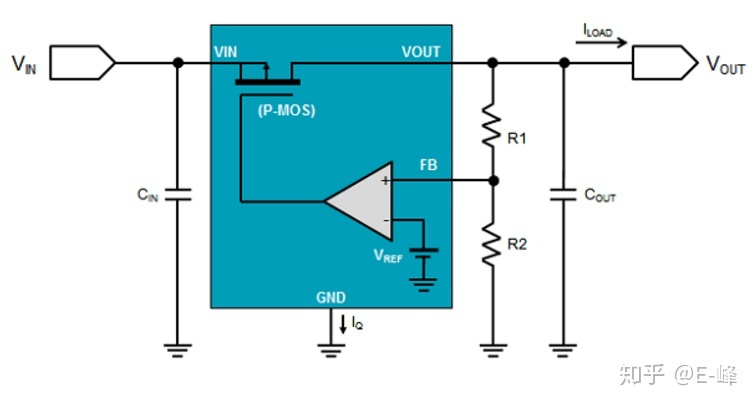
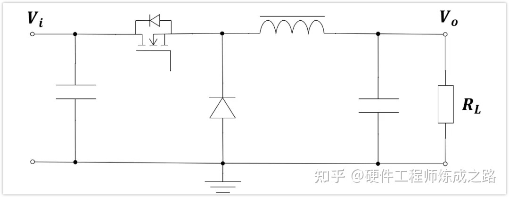
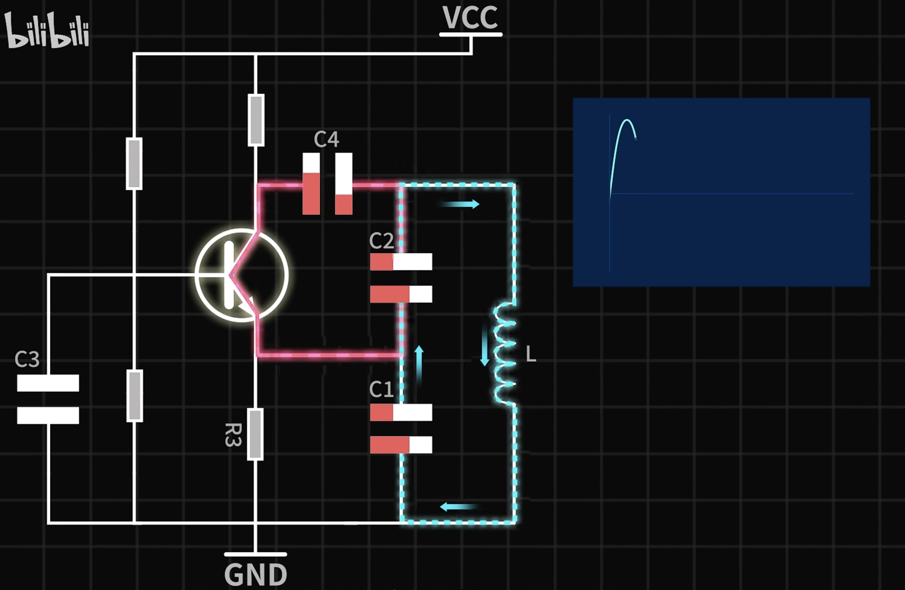

- [电源](#电源)
  - [降压电路](#降压电路)
    - [LDO（low dropout regulator）](#ldolow-dropout-regulator)
      - [PSRR(Power Supply Ripple Rejection)](#psrrpower-supply-ripple-rejection)
    - [BUCK](#buck)
- [电路安全](#电路安全)
  - [隔离](#隔离)
    - [隔离电源模块](#隔离电源模块)
    - [数字隔离器](#数字隔离器)
  - [EMC (Electromagnetic Compatibility) 电磁兼容性](#emc-electromagnetic-compatibility-电磁兼容性)
    - [浪涌](#浪涌)
- [干扰](#干扰)
  - [纹波](#纹波)
- [Resonate Circuit](#resonate-circuit)
- [BJT](#bjt)
- [传感器](#传感器)
    - [自动调零](#自动调零)
- [Check List](#check-list)

## 电源

### 降压电路

#### LDO（low dropout regulator）

低压差线性稳压器

LDO核心架构：P-MOS+运放，通过芯片内部已经设置好的电阻来达到调节P-MOS的输出，而得到该芯片的输出电压。
LDO工作原理就一句话：通过运放调节P-MOS的输出。

LDO重要参数：
1. 压差：输入电压需大于输出电压且大于最小压差
2. 裕量电压：裕量电压是指 LDO 满足其规格所需的输入至输出电压差
3. 效率：LDO 的效率由接地电流和输入/输出电压确定
$$P = I_{OUT}/(I_{OUT}+I_{GND})\times V_{OUT}/V_{IN}\times 100\% $$

在大多数应用中,LDO 主要用于将灵敏的负载与有噪声的电源相隔离。与开关稳压器不同,线性稳压器会在通路晶体管或MOSFET(用来调节和保持输出电压来达到所需的精度)中造成功率耗散。因此,就效率而言,LDO 的功率耗散会是一个显著劣势,并可能导致热问题。所以, 设计工程师需要通过尽可能降低 LDO 功率耗散,来提升系统效率和避免热复杂性,这一点很重要。

##### PSRR(Power Supply Ripple Rejection)
电源纹波抑制比

#### BUCK

## 电路安全

### 隔离

#### 隔离电源模块

#### 数字隔离器
在电气隔离器状态下实现数字信号传递

**光耦隔离**
optical coupler 

**容耦隔离**

**磁耦隔离**
磁耦是芯片级变压器隔离技术

### EMC (Electromagnetic Compatibility) 电磁兼容性

EMC分为EMS（electromagnetic susceptibility）电磁抗扰度和EMI（ Electromagnetic interference）电磁干扰两部分

#### 浪涌
接口处串联电阻：浪涌电流
接口处接TVS：浪涌电压

防爆安全-[安全栅](../Ex/IntrinsicSafety.md#安全栅)

## 干扰

### 纹波
> [理解输出电压纹波和噪声一：输出电压纹波来源和抑制](https://e2echina.ti.com/blogs_/b/power_house/posts/53234)

## Resonate Circuit

 - | -
:-------------------------:|:-------------------------:
 | 

> [振荡电路原理（B站）](https://www.bilibili.com/video/BV1La4y1g7GC/?spm_id_from=333.788&vd_source=bc1fa6dcfe143fdb1cf9fab62f9aae02)

## BJT
base 和 be 之间加入电阻的作用：
1. R1和R2构成分压，可以用来限制在输入电压大于一定值时才使三极管导通。
2. 在输入电压为未知时，比如说单片机的IO为高阻态时，用R2下拉，使得三极管截止。

## 传感器
#### 自动调零

## Check List
current mirror

amplifying transconductance