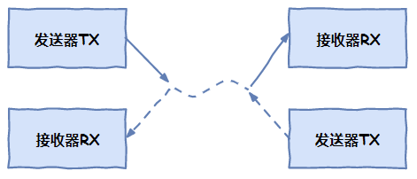
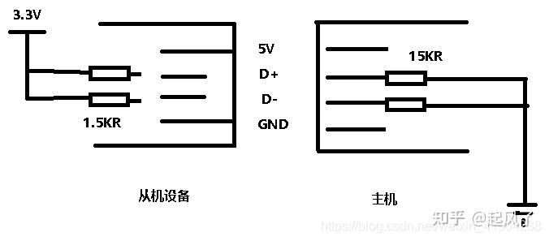

- [全双工 与 半双工](#全双工-与-半双工)
- [通讯协议](#通讯协议)
  - [I2C](#i2c)
  - [SPI 协议](#spi-协议)
  - [USB (Universal Serial Bus)](#usb-universal-serial-bus)
    - [USB编码 （NRZI 编码（Non-Return-to-Zero Inverted Code）](#usb编码-nrzi-编码non-return-to-zero-inverted-code)
  - [UART](#uart)
  - [电平标准](#电平标准)
    - [TTL (Transistor Transistor Logic)](#ttl-transistor-transistor-logic)
    - [RS-232](#rs-232)
    - [RS-485](#rs-485)
    - [CMOS](#cmos)
  - [MODEM](#modem)
    - [DCD、DTR、DSR、RTS及CTS等五个状态指示](#dcddtrdsrrts及cts等五个状态指示)
  - [TCP/IP](#tcpip)

## 全双工 与 半双工

**全双工**：两条线同时传输

**半双工**： 
    

**半工**：

## 通讯协议

首先，串口、UART口、COM口、USB口是指的物理接口形式(硬件)。而TTL、RS-232、RS-485是指的电平标准(电信号)。

串口：串口是一个泛称，UART，TTL，RS232，RS485都遵循类似的通信时序协议，因此都被通称为串口。

UART接口：通用异步收发器（Universal Asynchronous Receiver/Transmitter)，UART是串口收发的逻辑电路，这部分可以独立成芯片，也可以作为模块嵌入到其他芯片里，单片机、SOC、PC里都会有UART模块。
COM口：特指台式计算机或一些电子设备上的D-SUB外形(一种连接器结构，VGA接口的连接器也是D-SUB)的串行通信口，应用了串口通信时序和RS232的逻辑电平。
USB口：通用串行总线，和串口完全是两个概念。虽然也是串行方式通信，但由于USB的通信时序和信号电平都和串口完全不同，因此和串口没有任何关系。USB是高速的通信接口，用于PC连接各种外设，U盘、键鼠、移动硬盘、当然也包括“USB转串口”的模块。（USB转串口模块，就是USB接口的UART模块）
TTL，RS232，RS485都是一种逻辑电平的表示方式

### I2C

### SPI 协议

### USB (Universal Serial Bus)
[USB协议详解（CSDN专栏）](http://t.csdn.cn/fqRia)
[USB协议（知乎）](https://zhuanlan.zhihu.com/p/558672045)

USB协议采用的是差分传输模式

**USB的电气特性**

主机端的D-和D+数据线各自被串联15KR电阻下拉到地，当没有USB设备插入的时候，这两条数据线就一直呈现低电平状态。

USB是一种主从工作模式，大多数时候主机被叫“Host”，从机被叫“Device”

设备端的D-或者D+数据线，串联一个1.5KR的电阻上拉到3.3V，一旦设备插入主机，那么当主机捕捉到自身的D-或者D+被拉到高电平时，就知道有USB设备连接进来了，这样就检测到有外来USB设备接入了。

对于从机设备中到底是D-还是D+串联1.5KR电阻，这个就要有传输协议的模式来决定了，当配置成全速或高速时，就由D+串联电阻；当配置成低速时，就是D-串联电阻了。

简单来说就是快的就连D+，慢的就连D-。

**USB总线状态**

#### USB编码 （NRZI 编码（Non-Return-to-Zero Inverted Code）
[USB编码方式（NRZI）及时钟同步方式（CSDN）](https://blog.csdn.net/weiaipan1314/article/details/111877381)
**USB自同步传输**
USB没有时钟信号

**RZ 编码（Return-to-zero Code）**：在 RZ 编码中，正电平代表逻辑 1，负电平代表逻辑 0，并且，每传输完一位数据，信号返回到零电平，也就是说，信号线上会出现 3 种电平：正电平、负电平、零电平

因为每位传输之后都要归零，所以接受者只要在信号归零后采样即可，这样就不在需要单独的时钟信号。实际上， RZ 编码就是相当于把时钟信号用归零编码在了数据之内。这样的信号也叫做自同步（self-clocking）信号。

因为RZ编码每次信号传输都要归零，浪费带宽，所以使用NRZI

NRZI 都没有自同步特性，但是可以用一些特殊的技巧解决。

比如，先发送一个同步头，内容是 0101010 的方波，让接受者通过这个同步头计算出发送者的频率，然后再用这个频率来采样之后的数据信号，就可以了。

**NRZI**
NRZI 用信号的翻转代表一个逻辑，信号保持不变代表另外一个逻辑。

USB 传输的编码就是 NRZI 格式，在 USB 中，电平翻转代表逻辑 0，电平不变代表逻辑1

这样的通讯方法仍然存在一个问题，假如数据信号是 1000 个逻辑 1，经过 USB 的 NRZI 编码之后，就是很长一段没有变化的电平，在这种情况下，即使接受者的频率和发送者相差千分之一，就会造成把数据采样成 1001 个或者 999 个 1了。

USB 对这个问题的解决办法，就是强制插 0，也就是传说中的 bit-stuffing，如果要传输的数据中有 6个连续的 1，发送前就会在第 6 个 1 后面强制插入一个 0，让发送的信号强制出现翻转，从而强制接受者进行频率调整。这样还是会有一个问题，就是虽然接受者可以主动和发送者的频率匹配，但是两者之间总会有误差。

### UART
[URAT 知乎](https://zhuanlan.zhihu.com/p/182321407)

Universal Asynchronous Receiver/Transmitter，意为通用异步收发传输器。全双工通讯

<i>URAT帧模式(Frame Format)</i>

起始位：发送1位逻辑0（低电平），开始传输数据。
数据位：可以是5~8位的数据，先发低位，再发高位，一般常见的就是8位（1个字节），其他的如7位的ASCII码。
校验位：奇偶校验，将数据位加上校验位，1的位数为偶数（偶校验），1的位数4为奇数（奇校验）。
停止位：停止位是数据传输结束的标志，可以是1/1.5/2位的逻辑1（高电平）。
空闲位：空闲时数据线为高电平状态，代表无数据传输。

**UART传输速率的概念——波特率**
波特率的单位是bps，全称是bit per second，意为每秒钟传输的bit数量。

为了确保数据传输的正确性，减少误差，一般UART1和UART2之间的波特率差别小于10%，一次最多只能传输1个字节（8bit），也有效减小了累计误差。

### 电平标准
#### TTL (Transistor Transistor Logic)
即晶体管-晶体管逻辑电平。

TTL电平信号规定，**+5V等价于逻辑“1”，0 V等价于逻辑“0”** (采用二进制来表示数据时)。

这样的数据通信及电平规定方式，被称做TTL（晶体管-晶体管逻辑电平）信号系统，这是计算机处理器控制的设备内部各部分之间通信的标准技术。一般的电子设备用的多是TTL电平，但是它的驱动能力和抗干扰能力很差，不适合作为外部的通信标准，一些通信方式如RS232、RS485、USB等在传输线上使用的不是TTL电平，因此这些通信线上的信号在电子设备端要进行电平转换，才能够正常通信。

#### RS-232
**RS-232电平：全双工 (逻辑1：-15V--5V 逻辑0：+3V--+15V)**

rs232 的逻辑电平和TTL 不一样但是协议一样。

#### RS-485
[RS-485 知乎](https://zhuanlan.zhihu.com/p/341845459)

标准名称是TIA485/EIA-485-A

使用差分传输，共模抑制。使用一对双绞线，其中一根线定义为A，另一个定义为B.
RS-485不需要使用特定的总线电压，只看最小差分电压，在较长的电缆长度上，接收器接收到的电压可能会降低到+/- 200 mV，这对于RS-485仍然是完全可以接受的，这也是RS-485的优点之一。

半双工模式

**RS-485：半双工、（逻辑1：+2V--+6V 逻辑0： -6V---2V）**

- A和B为总线；
- R为接收器输入；
- RE为接收器使能信号；
- DE为发送器使能信号；
- D为发送器输出

**发送器：**
当驱动器使能引脚DE为逻辑高时，差分输出A和B遵循数据输入D处的逻辑状态。D处的逻辑高导致A转为高，B转为低。在这种情况下，定义为VOD=VA-VB的差分输出电压为正。当D为低时，输出状态反转，B变高，A变低，VOD为负。

**接收器：**
当接收器使能引脚RE逻辑低时，接收器被激活。当定义为VID=VA–VB的差分输入电压为正且高于正输入阈值VIT+时，接收机输出R变高。当VID为负且低于负输入阈值VIT-，接收机输出R变低。如果VID在VIT+和VIT-之间，则输出不确定。

有一些电路中会在A上加上拉，B上加下拉电阻，主要原因是：RS-485总线在idle状态，电平是不固定的，即电平在-200mV~+200mV之间，收发器可能输出高也可能输出低，UART在空闲时需要保持高电平的，如果此时收发器输出一个低电平，对UART来说是一个start bit，会导致通信异常

#### CMOS

输出L：<0.1*Vcc；H:>0.9*Vcc。

输入L：<0.3*Vcc；H:>0.7*Vcc。

### MODEM

#### DCD、DTR、DSR、RTS及CTS等五个状态指示
[CSDN Reference](https://blog.csdn.net/xqhrs232/article/details/8544054)

DCD （ Data Carrier Detect 数据载波检测）

DTR（Data Terminal Ready，数据终端准备好）

DSR（Data Set Ready 数据准备好）

RTS（ Request To Send 请求发送）

CTS（Clear To Send 清除发送）

### TCP/IP
TCP/IP (Transmission Control Protocol/Internet Protocol):传输控制协议和网络协议是用于因特网 (Internet) 的通信协议。

TCP (Transmission Control Protocol)和UDP(User Datagram Protocol)协议属于传输层协议。