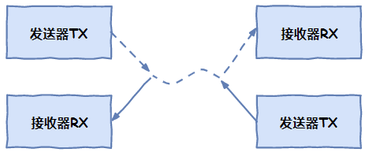
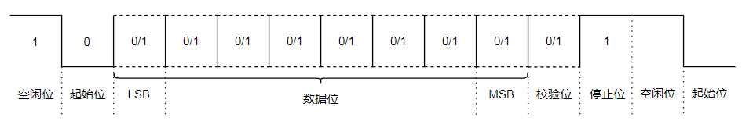

- [全双工 与 半双工](#全双工-与-半双工)
- [通讯协议](#通讯协议)
  - [USB (Universal Serial Bus)](#usb-universal-serial-bus)
  - [TTL (Transistor Transistor Logic)](#ttl-transistor-transistor-logic)
  - [UART](#uart)
  - [RS-232](#rs-232)
  - [RS-485](#rs-485)
  - [MODEM](#modem)
    - [DCD、DTR、DSR、RTS及CTS等五个状态指示](#dcddtrdsrrts及cts等五个状态指示)

## 全双工 与 半双工

**全双工**：两条线同时传输

**半双工**： 
    

**半工**：

## 通讯协议

### USB (Universal Serial Bus)

### TTL (Transistor Transistor Logic)
即晶体管-晶体管逻辑电平。TTL电平信号规定，+5V等价于逻辑“1”，0 V等价于逻辑“0”(采用二进制来表示数据时)。这样的数据通信及电平规定方式，被称做TTL（晶体管-晶体管逻辑电平）信号系统，这是计算机处理器控制的设备内部各部分之间通信的标准技术。一般的电子设备用的多是TTL电平，但是它的驱动能力和抗干扰能力很差，不适合作为外部的通信标准，一些通信方式如RS232、RS485、USB等在传输线上使用的不是TTL电平，因此这些通信线上的信号在电子设备端要进行电平转换，才能够正常通信。

### UART
[URAT 知乎](https://zhuanlan.zhihu.com/p/182321407)

Universal Asynchronous Receiver/Transmitter，意为通用异步收发传输器。全双工通讯

<i>URAT帧模式(Frame Format)</i>

起始位：发送1位逻辑0（低电平），开始传输数据。
数据位：可以是5~8位的数据，先发低位，再发高位，一般常见的就是8位（1个字节），其他的如7位的ASCII码。
校验位：奇偶校验，将数据位加上校验位，1的位数为偶数（偶校验），1的位数4为奇数（奇校验）。
停止位：停止位是数据传输结束的标志，可以是1/1.5/2位的逻辑1（高电平）。
空闲位：空闲时数据线为高电平状态，代表无数据传输。

**UART传输速率的概念——波特率**
波特率的单位是bps，全称是bit per second，意为每秒钟传输的bit数量。

为了确保数据传输的正确性，减少误差，一般UART1和UART2之间的波特率差别小于10%，一次最多只能传输1个字节（8bit），也有效减小了累计误差。

### RS-232

### RS-485
[RS-485 知乎](https://zhuanlan.zhihu.com/p/341845459)

标准名称是TIA485/EIA-485-A

使用差分传输，共模抑制。使用一对双绞线，其中一根线定义为A，另一个定义为B.
RS-485不需要使用特定的总线电压，只看最小差分电压，在较长的电缆长度上，接收器接收到的电压可能会降低到+/- 200 mV，这对于RS-485仍然是完全可以接受的，这也是RS-485的优点之一。

半双工模式

- A和B为总线；
- R为接收器输入；
- RE为接收器使能信号；
- DE为发送器使能信号；
- D为发送器输出

**发送器：**
当驱动器使能引脚DE为逻辑高时，差分输出A和B遵循数据输入D处的逻辑状态。D处的逻辑高导致A转为高，B转为低。在这种情况下，定义为VOD=VA-VB的差分输出电压为正。当D为低时，输出状态反转，B变高，A变低，VOD为负。

**接收器：**
当接收器使能引脚RE逻辑低时，接收器被激活。当定义为VID=VA–VB的差分输入电压为正且高于正输入阈值VIT+时，接收机输出R变高。当VID为负且低于负输入阈值VIT-，接收机输出R变低。如果VID在VIT+和VIT-之间，则输出不确定。

有一些电路中会在A上加上拉，B上加下拉电阻，主要原因是：RS-485总线在idle状态，电平是不固定的，即电平在-200mV~+200mV之间，收发器可能输出高也可能输出低，UART在空闲时需要保持高电平的，如果此时收发器输出一个低电平，对UART来说是一个start bit，会导致通信异常

### MODEM

#### DCD、DTR、DSR、RTS及CTS等五个状态指示
[CSDN Reference](https://blog.csdn.net/xqhrs232/article/details/8544054)

DCD （ Data Carrier Detect 数据载波检测）

DTR（Data Terminal Ready，数据终端准备好）

DSR（Data Set Ready 数据准备好）

RTS（ Request To Send 请求发送）

CTS（Clear To Send 清除发送）