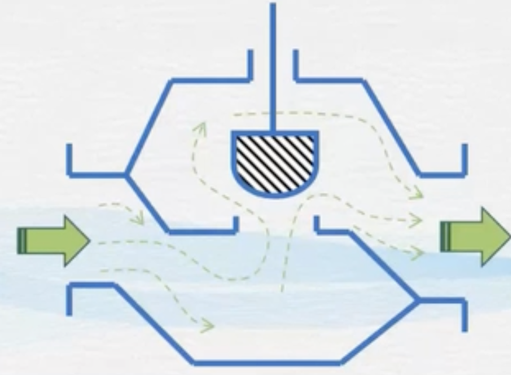
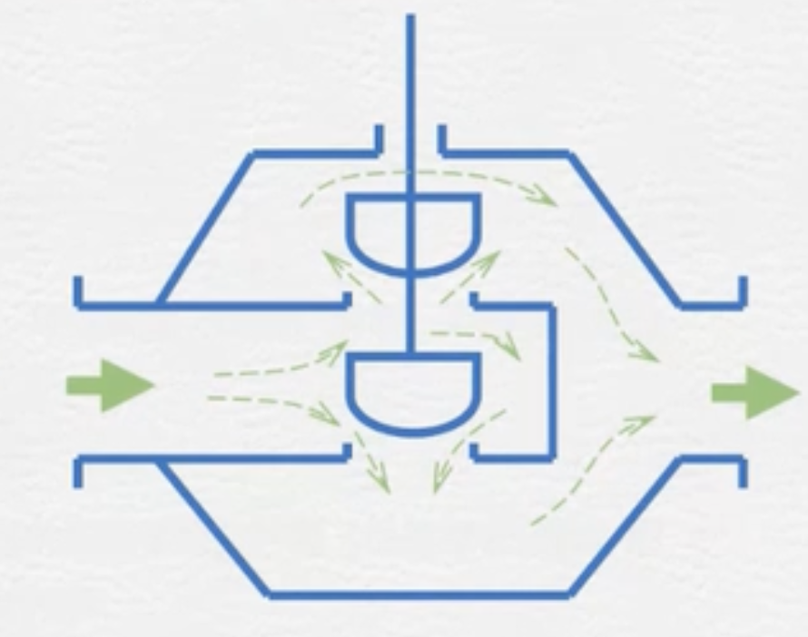
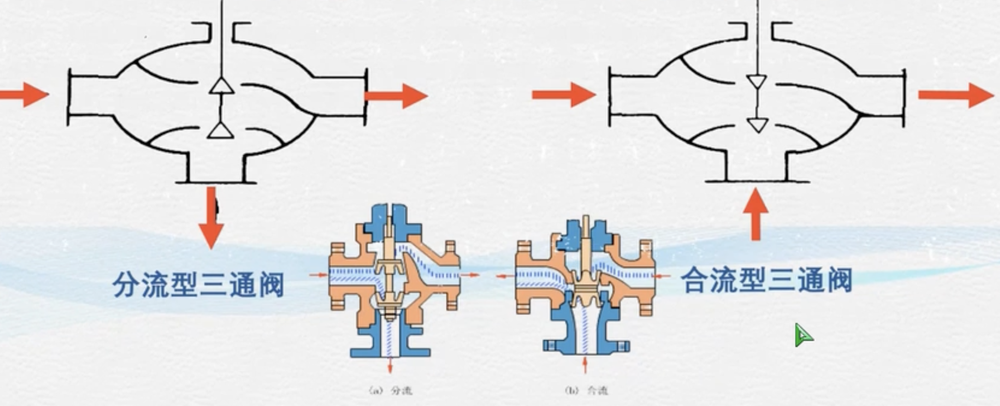
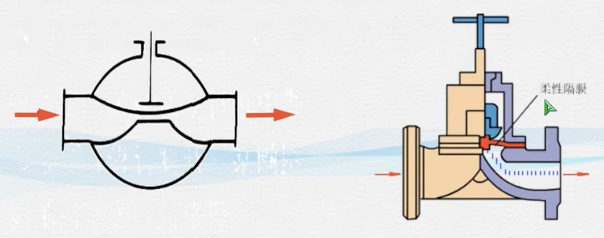
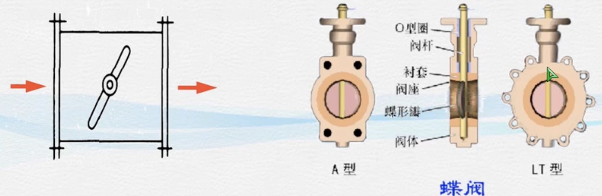
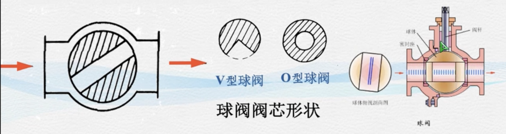
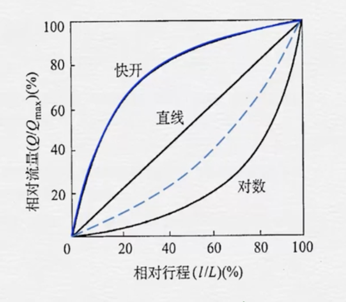
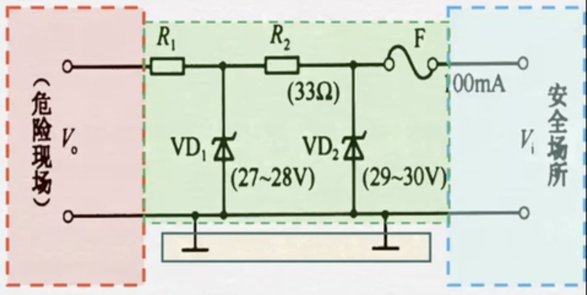

## 安全栅

### 阀门
| 阀门 | 特点 | 适用场合 | 示意图 | 备注 |
|---|---|---|---|---|
| 直通单座阀 | 结构简单，泄漏量小  |  小口径，低压差 |   |  可正接可反接，压力方向不同 |
| 直通双座阀 | 两个阔芯上的附加不平衡推力大小相近、方向相反，可以互相抵消，所以作用在网杆上的不平衡（合）力很小  |  大口径，大压差 |    | 由于加工精度问题很难保证两个阀门同时关闭，泄漏量大|
| 角型控制阀 | 一般为底进侧出，网内流体流路简单、对流体的阻力较小。  | 适用于现场管道要求直角连接，介质为高粘度、高压差和含有少量悬浮物和固体颗粒状 |   |   |
| 三通控制阀 |   | (入流恒流)旁路控制与(合流)配比控制  |   |   |
| 隔膜控制阀 | 采用耐腐蚀材料作隔膜，将网芯与流体介质隔开。结构简单、流阻小、流通能力比同口径的其它阀大。隔膜将流体与网芯、网体隔离，泄漏非常小。|   |   |   |
| 碟阀 |  结构简单、流阳极小，但关闭时泄漏量大 | 大口径大流量低压差 |   |   |
| 球阀 | 控制过程沆量变化较快，可起切断阀作用 | 双位式（通/断）控制 |  |   |
|  笼式(套筒)阀 | 可调比大，不平衡力小 | 不适用于高粘度或带有悬浮物(容易造成堵塞) 的介质流量控制 |  |   |
| 凸轮挠曲阀 | 阀芯球面与阀座密封圈紧密接触，密封性好 | 高粘度或带有悬浮物的介质流量控制 |  |   |

调节闷除了结构类型的不同外，主要技术参数是流量特性和口徑

#### 流量特性
相对流量 $Q/Q_{max}$ 
相对开度：$l/L$
$$ Q/Q_{max}=f(l/L)$$ 
流量特性与压差有关

### 齐纳式安全栅(Zener Safety barrier)
| 齐纳式安全栅  | 改进齐纳式安全栅 |
|:-:|:-:|
| | |

用电阻存在缺点
齐纳式安全栅在其内部电路中串联快速熔断丝、限流电阻和并联限压齐纳二极管，从而实现限制能量的作用，它具有如下一些特点：
1. 必须有单独的、非常可靠的接地系统(本安系统接地)，接地电阻应小于1Ω；
2. 不能进行电信号转换，对于热电偶/热电阻(RTD)等信号可能会由于电磁干扰而出现错误，因此不适合连接该类型的传感器；
3. 对供电电源电压影响非常大，电源电压的波动可能会引起齐纳二极管的电流泄漏，从而引起信号的误差或者发出错误电平，严重时会使快速保险丝烧断而永久损坏。按规定齐纳式安全栅内部齐纳管、限流电阻、保险丝整体浇封，一旦损坏无法修复；
4. 体积小，价格便宜，不需要额外供电；

### 隔离式安全栅(Isolated Safety barrier)

隔离式安全栅的输入、输出及电源三者之间相互隔离，它具有如下一些特点：
1. 不需要接地线，现场施工非常方便；
2. 由于信号线无需共地，使得整个系统的稳定性和抗干扰能力大大增强；
3. 具有信号转换能力，可以处理热电偶/热电阻/频率等信号，比如将其转换成4~20mA的电流信号输出，抗干扰能力比较强；
4. 一般隔离式安全栅具有两路输出通道，相互之间电气隔离，互不影响；
5. 价格相对贵些，需要外部供电

#### 倍加福隔离式安全栅
