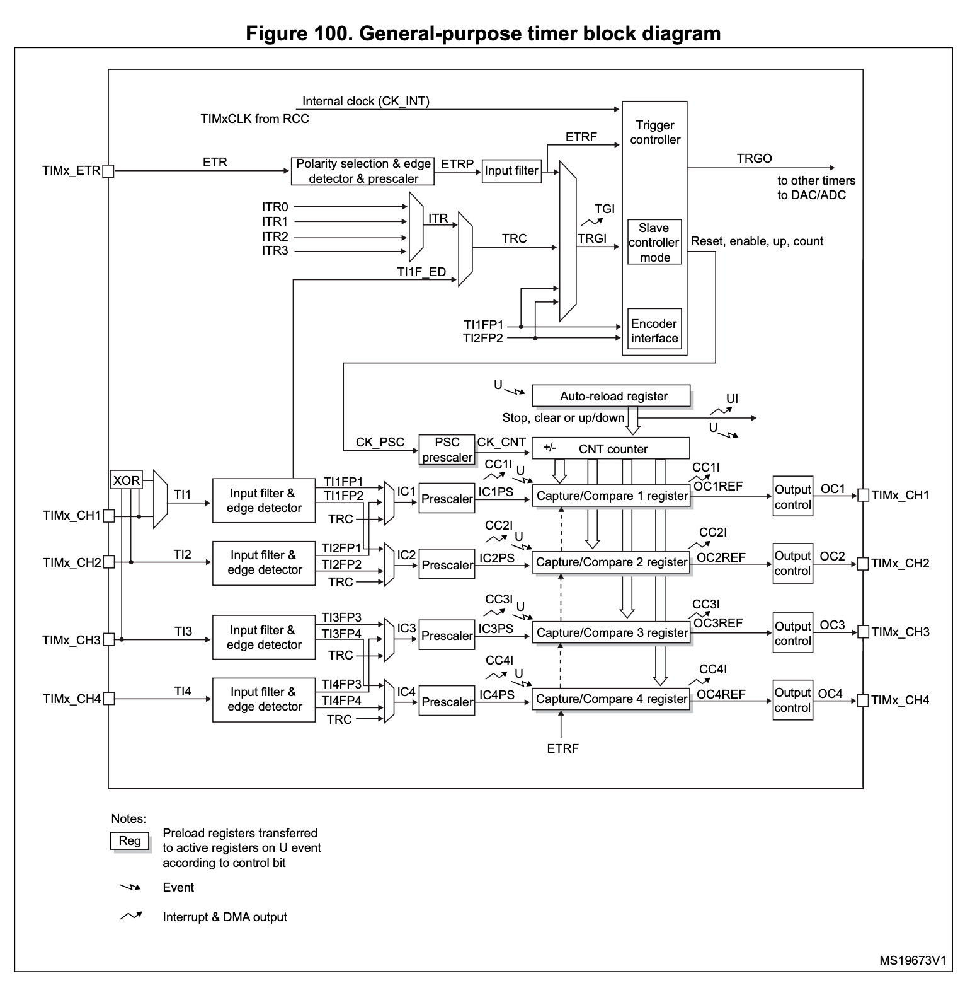
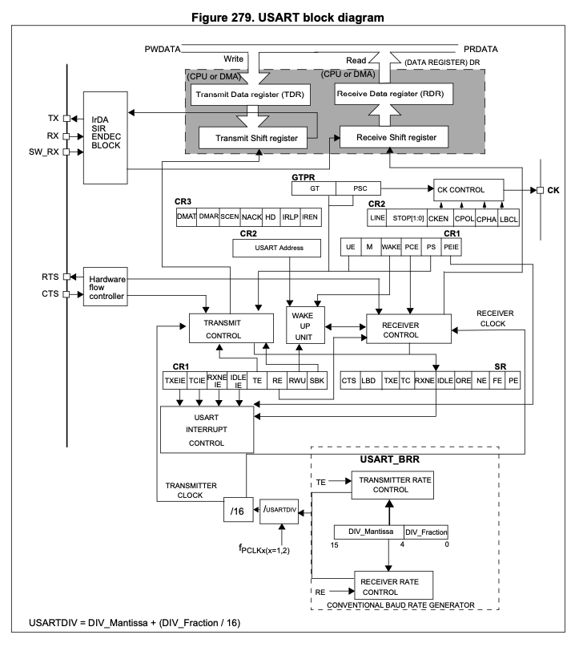
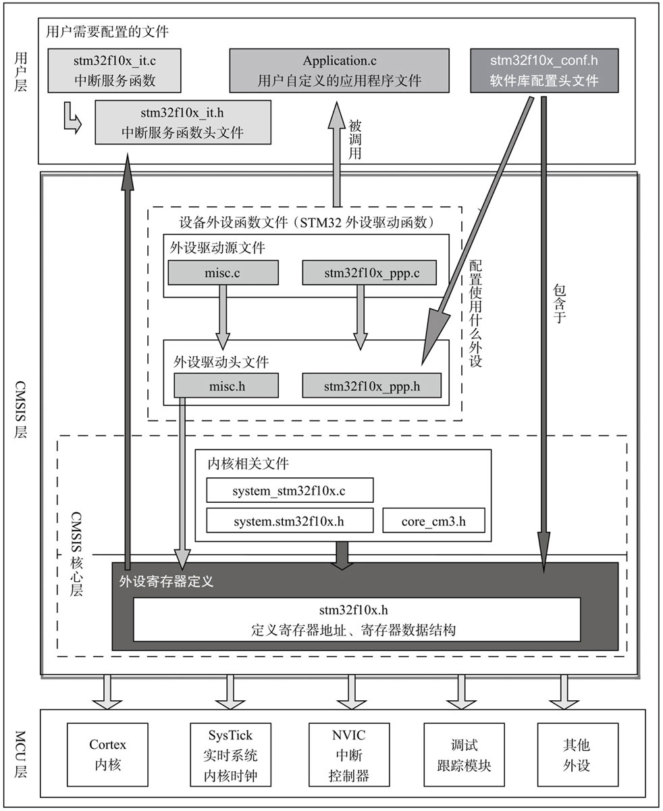

- [MCU 组成](#mcu-组成)
  - [CPU](#cpu)
  - [总线](#总线)
  - [储存器](#储存器)
    - [非易失性储存器](#非易失性储存器)
    - [易失性储存器](#易失性储存器)
    - [FSMC](#fsmc)
    - [AHB 到 APB 的桥（片上外设）](#ahb-到-apb-的桥片上外设)
  - [时钟系统](#时钟系统)
    - [定时器](#定时器)
    - [看门狗（WatchDog）](#看门狗watchdog)
    - [RTC](#rtc)
  - [模拟模块](#模拟模块)
    - [ADC](#adc)
    - [比较器（COMP）](#比较器comp)
  - [总线](#总线-1)
- [Function](#function)
  - [GPIO](#gpio)
  - [AFIO](#afio)
  - [中断](#中断)
    - [EXTI (Extern Interrupt)](#exti-extern-interrupt)
    - [TIM](#tim)
    - [OC (Output Compare)](#oc-output-compare)
      - [PWM](#pwm)
        - [IC (Input Capture)](#ic-input-capture)
  - [USART](#usart)
    - [USART RX](#usart-rx)
- [I2C](#i2c)
- [Project](#project)
- [Check List](#check-list)

## MCU 组成

### CPU

### 总线

ICode 总线

DCode 总线 (Data): 读取数据

System 总线：访问外设寄存器

DMA (Direct Memory Access) 总线：传输数据

因为数据可以被 DCode 总线和 DMA 总线访问，所以为了避免访问冲突，在取数的时候需要经过一个总线矩阵来仲裁，决定哪个总线取数。

### 储存器

#### 非易失性储存器

掉点后数据不会丢失
Flash Memory

System Memory: ROM，MCU 出厂后不可以更改，一般内置 bootloader，帮助串口下载

> ROM: 只读存储器（Read-Only Memory）

#### 易失性储存器

掉电后数据丢失
RAM

SRAM（Static Random Access Memory）静态随机存储器

> [SRAM 科普](https://zhuanlan.zhihu.com/p/392836594)

#### FSMC

#### AHB 到 APB 的桥（片上外设）

片上外设区分为 3 条总线，根据不同的外设速度，不同总线挂载着不同的外设，APB1 挂载低速外设，APB2 和 AHB 挂载高速外设。

### 时钟系统

HSI (Inside)

HSE (External)

STM32 有 4 个独立时钟源:HSI、HSE、LSI、LSE。

①HSI 是高速内部时钟，RC 振荡器，频率为 8MHz。  
②HSE 是高速外部时钟，可接石英/陶瓷谐振器，或者接外部时钟源，频率范围为 4MHz~16MHz。
③LSI 是低速内部时钟，RC 振荡器，频率为 40kHz。
④LSE 是低速外部时钟，接频率为 32.768kHz 的石英晶体。
⑤PLL 为锁相环倍频输出，其时钟输入源可选择为 HSI/2、HSE 或者 HSE/2。倍频可选择为 2~16 倍，但是其输出频率最大不得超过 72MHz。

其中 LSI 是作为 IWDGCLK(独立看门狗)时钟源和 RTC 时钟源 而独立使用

而 HSI 高速内部时钟 HSE 高速外部时钟 PLL 锁相环时钟 这三个经过分频或者倍频 作为系统时钟来使用

> 对于 SYSCLK、HCLK、PCLK2、PCLK1 这 4 个时钟的配置一般是：PCLK2=HCLK=SYSCLK=PLLCLK=72MHz，PCLK1=HCLK/2=36MHz。(STM32 库开发实战指南)

#### 定时器

| 定时器种类             | 位数 | 计数器模式          | 产生 DMA 请求 | 捕获/比较通道 | 互补输出                                     | 特殊应用场景 |
| ---------------------- | ---- | ------------------- | ------------- | ------------- | -------------------------------------------- | ------------ |
| 高级定时器(TIM1,TIM8)  | 16   | 向上，向下，向上/下 | 4             | 有            | 带死区控制盒鱉急刹车，可威用手 PWM 电机控制  |
| 通用定时器(TIM2~TIM5)  | 16   | 向上，向下，向上/下 | 4             | 无            | 通用．定时计数，PWM 输出．输入拥获，输出比较 |
| 基本定时器(TIM6, TIM7) | 16   | 向上，向下，向上/下 | 0             | 无            |

#### 看门狗（WatchDog）

原理：定时器计时，超出时间产生复位信号

IWDG: 独立看门狗
WWDG: 窗口看门狗

|          |            IWDG             |           WWDG            |
| :------: | :-------------------------: | :-----------------------: |
| 独立时钟 | 有独立时钟，40KHZ RC 振荡器 | 无独立时钟，使用 CPU 时钟 |
|   中断   |             有              |            无             |
| 控制方法 |         硬件或软件          |           软件            |
| 时钟长度 |          只有下限           |       有下限和上限        |
|          |          12 位递减          |         7 位递减          |

独立看门狗(IWDG)是独立于系统之外，因为有独立时钟，所以不受系统影响的系统故障探测器。主要用于监视硬件错误。

窗口看门狗(WWDG)是系统内部的故障探测器，时钟与系统相同。如果系统时钟不走了，这个狗也就失去作用了。主要用于监视软件错误。

#### RTC

### 模拟模块

#### ADC

#### 比较器（COMP）

电压比较，输出数字信号大于$V_{ref}$或小于$V_{ref}$

### 总线

## Function

### GPIO

输出方式： 输出(推挽或开漏)、输入(带或不带上拉或下拉)

| 程序中标识            | 模式         | -               | -                         |
| --------------------- | ------------ | --------------- | ------------------------- |
| GPIO_Mode_Out_PP      | 推挽输出     | Push-Pull       | General purpose output    |
| GPIO_Mode_Out_OD      | 开漏输出     | Open-Drain      |                           |
| GPIO_Mode_AF_PP       | 复用推挽输出 | Push-Pull       | Alternate Function output |
| GPIO_Mode_AF_OD       | 复用开漏输出 | Open-Drain      |                           |
| GPIO_Mode_AIN         | 模拟输入     | Analog          | Input                     |
| GPIO_Mode_IN_FLOATING | 浮空输入     | Input floating  |                           |
| GPIO_Mode_IPD         | 下拉输入     | Input pull-down |                           |
| GPIO_Mode_IPU         | 上拉输入     | input pull-up   |                           |

### AFIO

Alternate Function IO (复用)

### 中断

使用 NVIC 统一管理中断，每个中断通道都拥有 16 个可编程的优先等级，可对优先级进行分组，进一步设置抢占优先级和响应优先级

抢占优先级：可以暂停 CPU 现有的操作。
响应优先级：决定 CPU 执行完现有任务后执行其他任务的顺序（排队插队）

-   NVIC 的中断优先级由优先级寄存器的 4 位 （0-15） 决定，这 4 位可以进行切分，分为高 n 位的抢占优先级和低 4-n 位的响应优先级
-   抢占优先级高的可以中断能套，响应优先级高的可以优先排队，抢占优先级和响应优先级均相同的按中断号排队

配置完中断后，中断函数的名称是固定的，在启动文件(.s 文件)中寻找。

#### EXTI (Extern Interrupt)

EXTI 配置顺序：

```c
RCC_APB2PeriphClockCmd(RCC_APB2Periph_GPIOB, ENABLE);       // Turn on GPIO clock
RCC_APB2PeriphClockCmd(RCC_APB2Periph_AFIO, ENABLE);        // Turn on AFIO clock 服用引脚

// GPIO Initial
GPIO_InitTypeDef GPIO_InitStructure;
GPIO_InitStructure.GPIO_Mode  = GPIO_Mode_IPU;
GPIO_InitStructure.GPIO_Pin   = GPIO_Pin_10 | GPIO_Pin_11 | GPIO_Pin_1;
GPIO_InitStructure.GPIO_Speed = GPIO_Speed_50MHz;
GPIO_Init(GPIOB, &GPIO_InitStructure);

// Set GPIO as EXTI AFIO
GPIO_EXTILineConfig(GPIO_PortSourceGPIOB, GPIO_PinSource10);
GPIO_EXTILineConfig(GPIO_PortSourceGPIOB, GPIO_PinSource11);
GPIO_EXTILineConfig(GPIO_PortSourceGPIOB, GPIO_PinSource1);

// EXTI Initial
EXTI_InitTypeDef EXTI_InitStructure;
EXTI_InitStructure.EXTI_Line    = EXTI_Line10 | EXTI_Line11 | EXTI_Line1;
EXTI_InitStructure.EXTI_LineCmd = ENABLE;
EXTI_InitStructure.EXTI_Mode    = EXTI_Mode_Interrupt;
EXTI_InitStructure.EXTI_Trigger = EXTI_Trigger_Falling;
EXTI_Init(&EXTI_InitStructure);

// NVIC 优先级分组
NVIC_PriorityGroupConfig(NVIC_PriorityGroup_2);

// NVIC Initial
NVIC_InitTypeDef NVIC_InitStructure;
NVIC_InitStructure.NVIC_IRQChannel                   = EXTI15_10_IRQn;
NVIC_InitStructure.NVIC_IRQChannelPreemptionPriority = 1;
NVIC_InitStructure.NVIC_IRQChannelSubPriority        = 1;
NVIC_InitStructure.NVIC_IRQChannelCmd                = ENABLE;
NVIC_Init(&NVIC_InitStructure);

NVIC_InitStructure.NVIC_IRQChannel                   = EXTI1_IRQn;
NVIC_InitStructure.NVIC_IRQChannelPreemptionPriority = 1;
NVIC_InitStructure.NVIC_IRQChannelSubPriority        = 1;
NVIC_InitStructure.NVIC_IRQChannelCmd                = ENABLE;
NVIC_Init(&NVIC_InitStructure);
```

调用中断的函数命名查找`.s`文件，注意中断 5-9，以及中断 10-15 公用同一中断通道，使用一个函数。

```c
void EXTI15_10_IRQHandler(void)
{
    if (EXTI_GetITStatus(EXTI_Line10) == SET) {         // 判断中断线路
        if (GPIO_ReadInputDataBit(GPIOB, GPIO_Pin_11) == 0) {
            CountSensor_Count++;
        }
        EXTI_ClearITPendingBit(EXTI_Line10);    // 清除中断位标识，否则会持续进入中断
    }

    if (EXTI_GetITStatus(EXTI_Line11) == SET) {
        if (GPIO_ReadInputDataBit(GPIOB, GPIO_Pin_10) == 0) {
            CountSensor_Count--;
        }
        EXTI_ClearITPendingBit(EXTI_Line11);
    }
}
```

#### TIM

基本定时器
通用定时器

ETR (External)
ITR (Internal)
TRGI (Trigger Input)

#### OC (Output Compare)

##### PWM


###### IC (Input Capture)

### USART

[USART Note](../../Electrical/Hardware/DataTransfer/DataTransferNote.md#usart)

USART 发送数据时，使用发送数据寄存器（TDR）传入发送移位寄存器，数位位移进行发送给 TX 引脚

图中上半部分为数据传输部分，下半部分为控制部分

USART 输入采样时，需要控制其采样时处于每个 bit 信号发送的中间位置。在接收数据刚开始时 MCU 会使用 16 倍的采样速率进行判断采样的中间点。

#### USART RX

两种方式读取

1. 通过读取 USART 的状态 Flag 判断 RX 是否接收数据
2. 通过 USART 中断来接收数据

```c
/* Read the receive flag register to get the Received data */
while (1) {
    if (USART_GetFlagStatus(USART1, USART_FLAG_RXNE) == SET)
    {
        Serial_RxData = USART_ReceiveData(USART1);
        Serial_Printf("Received: %c", Serial_RxData);
    }
}
```

```c
void Initial()
{
    ......
    ......
    
    /* Interrupts Initial*/
    USART_ITConfig(USART1, USART_IT_RXNE, ENABLE);

    NVIC_PriorityGroupConfig(NVIC_PriorityGroup_2);

    NVIC_InitTypeDef NVIC_InitStructure;
    NVIC_InitStructure.NVIC_IRQChannel                   = USART1_IRQn;
    NVIC_InitStructure.NVIC_IRQChannelPreemptionPriority = 1;
    NVIC_InitStructure.NVIC_IRQChannelSubPriority        = 1;
    NVIC_InitStructure.NVIC_IRQChannelCmd                = ENABLE;
    NVIC_Init(&NVIC_InitStructure);
}

/* Interrupt function */
void USART1_IRQHandler(void)
{
    if (USART_GetITStatus(USART1, USART_IT_RXNE) == SET) {
        Data = USART_ReceiveData(USART1);
        ....
        // USART_IT_RXNE 在 USART_ReceiveData() 读取数据后会自动清零，也可以选择手动清零。
    }
}

```

## I2C

[USART Note](../../Electrical/Hardware/DataTransfer/DataTransferNote.md#i2c-inter－integrated-circuit)

## Project



## Check List
