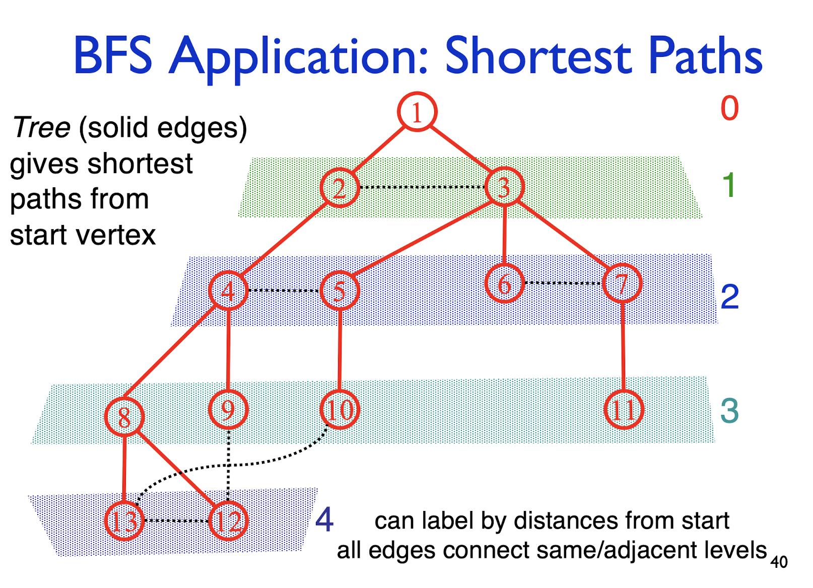

##### CSE 417: Homework 2
##### Name: Qingchuan Hou
##### Student ID: 2127437
##### UWNetID: qhou
 

Problem 2:

 The spanning tree produced by Breadth First Search in an undirected graph is a just set of edges. (It is not the drawing of those nodes and edges that we typically use to illustrate the algorithm.) The algorithm does not specify the order in which edges incident to a visited node are added to the queue, and different orders may result in different spanning trees (all equally valid). For BFS on the graph used as an example in lecture (approximately slides 37-40), always starting from node 1, how many different spanning trees are possible and briefly describe how each arises and what changes compared to the picture on slide 40.

    

There are other 3 different spanning tree are possible. The only difference these 4 tress in the edges bettween vertex {8, 9, 10, 12, 13}. There 5 trees are:
1. 8-12, 8-13 (Showing on the picture)
2. 8-13, 9-12
3. 9-12, 10-13
4. 8-12, 10-13

When use the BFS, if there have any edges between two different levels in the graph haven't been used in a BFS tree *(the broken line in the graph)*. That means there have differents spanning trees are also possible. *(If does not specify the order)* Because these egdes can replace a edges without change the level of every nodes.

The number of different trees is decided by the number of cross-level-edges for each nodes in deeper level. The number of differents trees is the product of these number of cross-level-edges for each nodes in deeper level. 

In this graph. There are un-used edges betwwen level 3 and 4. In deeper level, which is level 4, the nodes 13 and 12 both have 2 cross-level-edges. So the number of different spanning tree for BFS is: $2 \times 2 = 4$