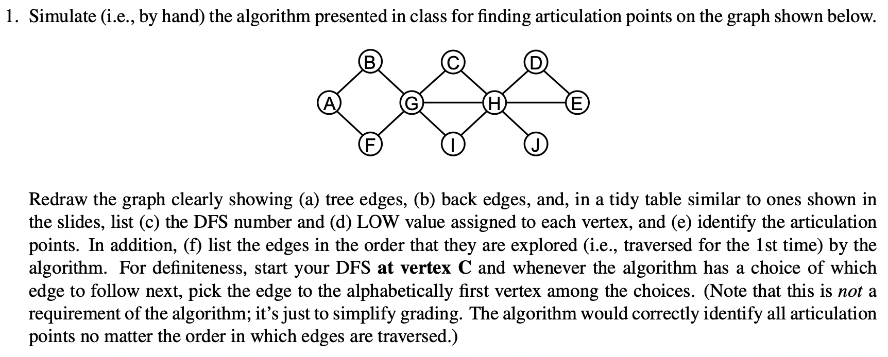
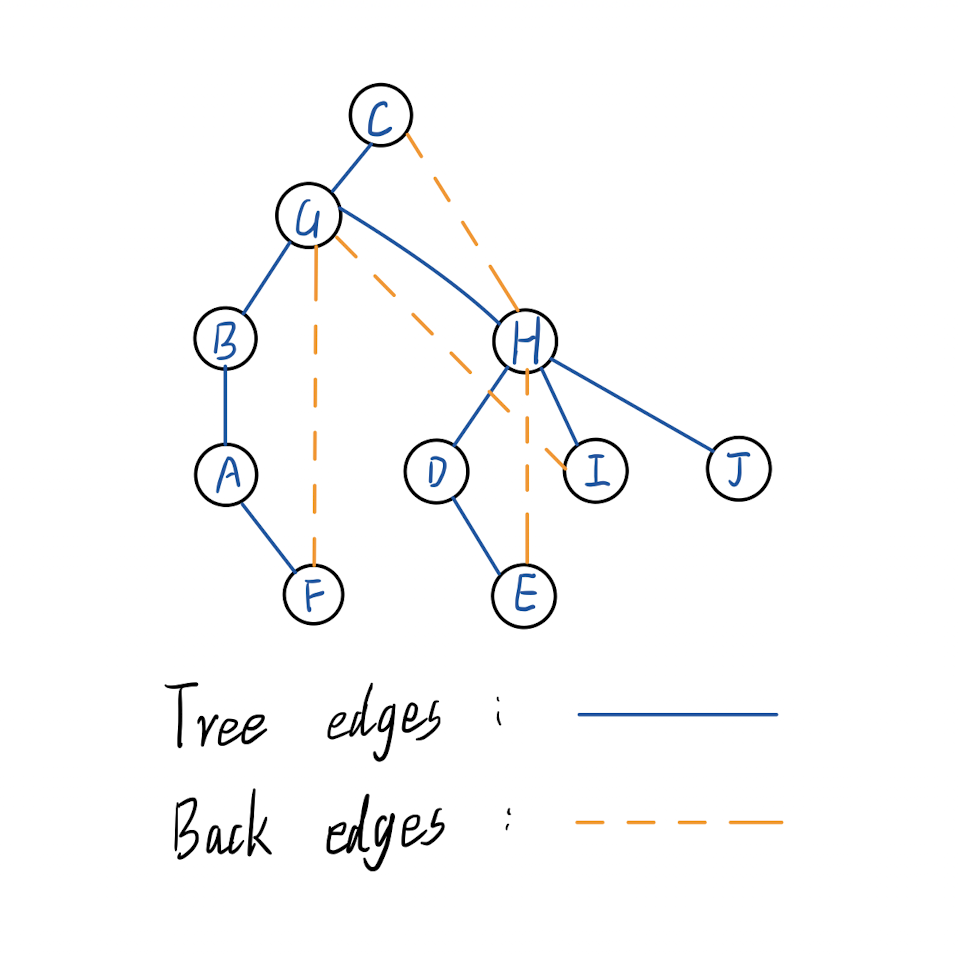

#### CSE 417: Homework 3
##### Name: Qingchuan Hou
##### Student ID: 2127437
##### UWNetID: qhou
 

Problem 1:

| | DFS Number | LOW value |
 -|-|-
 A | 4 | 2 |
 B | 3 | 2 |
 C | 1 | 1 |
 D | 7 | 6 |
 E | 8 | 6 |
 F | 5 | 2 |
 G | 2 | 1 |
 H | 6 | 1 |
 I | 9 | 2 |
 J | 10 | 10 |

 Articulation Point: G, H

 The edges explored order: (C,G) $ \rightarrow $ (G,B) $ \rightarrow $ (B,A) $ \rightarrow $ (A,F) $ \rightarrow $ (F,G) $ \rightarrow $ (G,H) $ \rightarrow $ (H,D) $ \rightarrow $ (D,E) $ \rightarrow $ (E,H) $ \rightarrow $ (H,I) $ \rightarrow $ (I,G) $ \rightarrow $ (H,J)